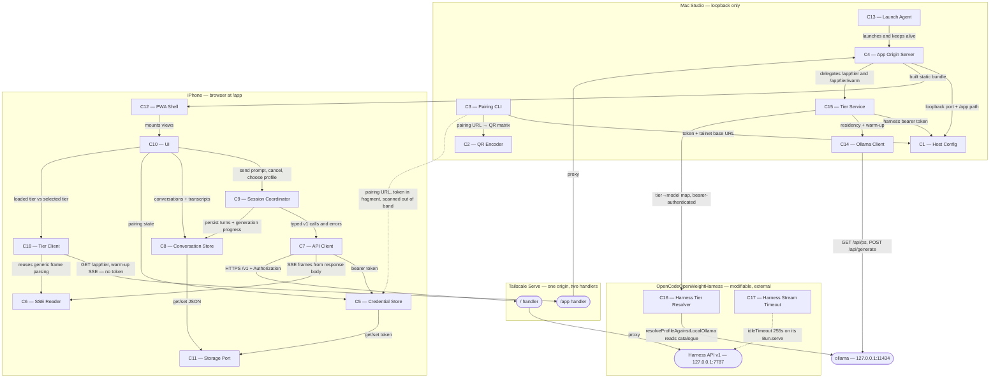

# Architecture

## Status

AGREED

## Overview

One origin, two Tailscale Serve handlers. Because the harness sends no CORS headers, the
app and the API must look to the browser like the same site: `/app` proxies to a static
asset server in this repository, while `/` continues to proxy the untouched harness on
`127.0.0.1:7787`. Everything else follows from that — the phone runs a plain
TypeScript PWA that holds the bearer token, streams generations over `fetch` because
`EventSource` cannot authenticate, and persists enough state to resume a generation after
iOS terminates the page.

The `/app` origin also carries a second, smaller surface: which model tier is resident on
the Studio right now, and a warm-up that loads a tier on request. That surface is
deliberately outside the v1 API — it never creates a session, appends no turns, and does
not consume the single global generation slot — so it can never queue behind a real prompt.
It talks to ollama directly, and borrows the harness's own profile resolver over loopback
rather than reimplementing the tier-to-model mapping.

The harness repository is no longer exempt from modification. Two changes live there: a
non-v1 route that exposes its profile resolver, and an `idleTimeout` on its `Bun.serve`
that stops a cold model load from killing an SSE connection. They are separate components
because they must stay separately falsifiable.

## Diagram

## Components

### C1 — Host Config

Responsibility: Resolve the harness bearer token and the tailnet base URL, refusing a
token file that other users can read.
Location: `src/host/config.ts`
Depends on: None
Realises: FR1

### C2 — QR Encoder

Responsibility: Encode text into a QR matrix and render it for a terminal.
Location: `src/qr/`
Depends on: None
Realises: FR1

### C3 — Pairing CLI

Responsibility: Print a scannable QR code carrying the pairing URL for this machine.
Location: `src/host/pair.ts`
Depends on: C1, C2
Realises: FR1

### C4 — App Origin Server

Responsibility: Own the `/app` origin over loopback for Tailscale Serve to publish — the
built PWA bundle, plus the two tier routes, which it delegates to C15 rather than
implementing. Routing only: `resolveAssetPath` remains the containment boundary for every
path that is not a tier route.
Location: `src/host/pwa-server.ts`
Depends on: C1, C12, C15
Realises: FR2, FR12, FR13

### C5 — Credential Store

Responsibility: Capture the bearer token from the URL fragment, clear the fragment, and
hold the credential for the session.
Location: `web/src/credential-store.ts`
Depends on: C11
Realises: FR1, FR9

### C6 — SSE Reader

Responsibility: Turn a streaming response body into SSE frames, and frames into typed
harness events, tracking the last sequence number seen. The frame layer is generic over
the event union; the harness typing sits on top of it.
Location: `web/src/sse-reader.ts`
Depends on: None
Realises: FR4, FR7, FR10, FR13

### C7 — API Client

Responsibility: Call the documented v1 endpoints with authentication and map every
documented failure to a typed error. Capture the `x-generation-id` response header, and
classify an undocumented status received while a generation is in flight as recoverable
rather than minting `http_<status>`.
Location: `web/src/api-client.ts`
Depends on: C5, C6
Realises: FR4, FR5, FR6, FR7, FR8, FR9, FR10

### C8 — Conversation Store

Responsibility: Own the locally persisted conversations, their transcripts, and the
progress of any in-flight generation.
Location: `web/src/conversation-store.ts`
Depends on: C11
Realises: FR3, FR7, FR8

### C9 — Session Coordinator

Responsibility: Drive a generation's lifecycle — start, stream, cancel, resume, and
rebuild a lost session by replaying local turns. Owns the recovery loop: retry with
backoff against the generation's 300s wall-clock budget, surfacing an error only once that
budget is spent or the generation reaches a terminal state.
Location: `web/src/session-coordinator.ts`
Depends on: C7, C8
Realises: FR4, FR5, FR6, FR7, FR8, FR9, FR10

### C10 — UI

Responsibility: Render the conversation list and chat view, and translate user actions
into coordinator calls. Shows the resident tier distinctly from the tier the open
conversation has selected, and shows loading → ready when a tier is switched. Renders
tier labels only — never a physical model name, size, digest or quantization tag.
Location: `web/src/ui/`
Depends on: C5, C8, C9, C18
Realises: FR3, FR4, FR5, FR6, FR9, FR10, FR12, FR13

### C11 — Storage Port

Responsibility: Provide keyed persistence, backed by `localStorage` in the browser and by
memory in tests.
Location: `web/src/storage-port.ts`
Depends on: None
Realises: FR3, FR7, FR8

### C12 — PWA Shell

Responsibility: Make the app installable and loadable — document, manifest, icons and
service worker.
Location: `web/public/`
Depends on: C10
Realises: FR2

### C13 — Launch Agent

Responsibility: Keep the asset server running from login onwards, and restart it if it
exits.
Location: `deploy/`
Depends on: C4
Realises: FR2

### C14 — Ollama Client

Responsibility: Typed access to the two ollama surfaces this system uses — residency via
`GET /api/ps`, and warm-up via `POST /api/generate` with an empty prompt. Knows nothing
about tiers; it speaks in physical model names.
Location: `src/host/ollama-client.ts`
Depends on: None
Realises: FR12, FR13

### C15 — Tier Service

Responsibility: Own tier residency and the warm-up lifecycle. Intersects resident model
names with the tier→model map to answer which tier is loaded, runs supersede-able warm-ups
so only the most recently selected tier is warmed, and emits warm-up state as events.
Physical model names stop here and never reach a response body.
Location: `src/host/tier-service.ts`
Depends on: C1, C14, C16
Realises: FR12, FR13

### C16 — Harness Tier Resolver

Responsibility: Inside the harness repository, expose its existing
`resolveProfileAgainstLocalOllama` over a non-v1 loopback route, so the tier→model mapping
has exactly one implementation and this repository never duplicates or hardcodes it.
Location: `harness/api/server.ts` (external repo: `OpenCodeOpenWeightHarness`)
Depends on: None
Realises: FR12

### C17 — Harness Stream Timeout

Responsibility: Inside the harness repository, set `idleTimeout` on the API's `Bun.serve`
to 255s so a cold model load cannot close an SSE connection mid-generation. Kept separate
from C16 because AC13 and AC14 require this change to be revertible on its own.
Location: `harness/api/server.ts` (external repo: `OpenCodeOpenWeightHarness`)
Depends on: None
Realises: FR11

### C18 — Tier Client

Responsibility: Read the resident tier and consume the warm-up event stream, same-origin
and **unauthenticated** — it must never attach the bearer token, which belongs only to the
v1 API. Deliberately does not depend on C5 or C7.
Location: `web/src/tier-client.ts`
Depends on: C6
Realises: FR12, FR13

## Interfaces

**C3 → C1.** `readToken(env): string` and `resolveBaseUrl(env): string`. `readToken`
throws rather than returning a value when the token file's mode grants access to group or
other.

**C3 → C2.** `encodeQr(text, { ecc }): QrMatrix`, then `renderToAnsi(matrix): string`.
The matrix is a plain row-major bitmap; the encoder knows nothing about pairing.

**C3 ⇢ C5 (out of band).** The pairing URL `https://<host>/app/#t=<token>`, crossing from
the Mac's terminal to the phone by camera. The token is in the fragment specifically so it
is never transmitted to any server.

**C4 → C1.** The loopback port and the `/app` mount path, so the server and the pairing
URL cannot disagree about where the app lives.

**C4 → C12.** The built bundle directory is C4's content root.

**C13 → C4.** A launchd property list invoking the asset server, with `KeepAlive` and
`RunAtLoad`.

**C7 → C5.** `getToken(): string | null`. C7 attaches `Authorization: Bearer <token>` to
every request, including `/status`.

**C7 → C6.** `readEvents(body: ReadableStream): AsyncIterable<HarnessEvent>`, where
`HarnessEvent` is the union of `model-loading`, `content`, `queued`, `complete`, `error`
and `cancelled`.

**C9 → C7.** `listProfiles()`, `createSession()`, `appendTurn(sessionId, turn)`,
`generate(sessionId, { profileId, prompt })` returning the generation id and an event
iterable, `cancel(sessionId, generationId)`, and
`resumeEvents(sessionId, generationId, lastSeq)`.

**C9 → C8.** `loadConversations()`, `saveConversation(conversation)`,
`recordProgress(conversationId, { generationId, lastSeq })`.

**C10 → C9.** `send(conversationId, prompt)`, `cancel(conversationId)`,
`resumeIfInterrupted(conversationId)`, plus a subscription for streamed deltas and status
changes.

**C8 → C11 and C5 → C11.** `get(key): string | null`, `set(key, value)`, `remove(key)`.

**C7 → Tailscale Serve `/` handler → Harness API v1.** The documented HTTPS surface,
unchanged by this repository.

**Tailscale Serve `/app` handler → C4.** An operator-configured proxy to the loopback
asset server. It is configuration, not code, and must be applied once per machine.

**C18 → C4, `GET /app/tier`.** Returns `{ loaded: string | null }` — the resident tier's
profile id, or `null` meaning nothing is loaded. `null` is a truthful answer, not an error.
No `Authorization` header is sent or accepted.

**C18 → C4, `POST /app/tier/warm`.** Body `{ tierId }`. Responds with an SSE stream of
`loading` (a liveness heartbeat), `ready`, `superseded`, and `error`. It carries **no
progress percentage**: ollama's `/api/generate` reports load completion but not load
progress, so the stream reports state transitions and liveness only. A percentage would
require `/api/pull`, which is a different operation. The heartbeat is what keeps the
connection alive, so C4 needs no long idle window of its own.

**C18 → C6.** `readFrames(body: ReadableStream): AsyncIterable<SseFrame>`, where
`SseFrame` is `{ event, data, id }`. C18 maps frames to its own `WarmEvent` union, exactly
as `readEvents` maps them to `HarnessEvent`. Two consumers is what justifies splitting the
frame layer out; it is not a speculative abstraction.

**C4 → C15.** `loadedTier(): Promise<string | null>` and
`warm(tierId, signal): AsyncIterable<WarmEvent>`. C4 serialises these to HTTP and does no
tier logic itself.

**C15 → C14.** `listResident(): Promise<string[]>` returning physical model names from
`GET /api/ps`, and `warm(model, signal): AsyncIterable<WarmEvent>` driving
`POST /api/generate` with an empty prompt, which returns `done_reason: "load"`.

**C15 → C16, `GET /internal/tier-models`.** Returns `{ tiers: [{ id, model }] }`, called
over loopback with the harness bearer token read via C1. The path is outside `/v1`, so the
frozen v1 endpoint set is untouched. It is added inside `routeAuthenticated`, so
`withBearerAuth` — which wraps the whole router by construction — covers it without any
change to the harness's authentication posture.

**C15 → C1.** `readToken(env): string`, reused unchanged. The tier service authenticates to
the harness with the same credential the pairing CLI reads, and with the same refusal on a
group- or world-readable token file.

**C17 → the harness `Bun.serve`.** `idleTimeout: 255` seconds, set alongside
`development: false`. It sits below the 300s generation budget so the generation timeout
stays the governing limit rather than the socket.

## Data

`Conversation` — `{ id, title, sessionId, profileId, turns, pending, createdAt, updatedAt }`.
Owned by C8, persisted through C11 under a versioned key in `localStorage`.

`Turn` — `{ role, content, cancelled, createdAt }`. A local mirror of the service's turns,
which is what makes FR8's replay possible after the server's in-memory session is lost.

`PendingGeneration` — `{ generationId, lastSeq, status }`. Persisted rather than held in
memory, because iOS may terminate a backgrounded page outright; without this on disk a
resume is impossible.

`Credential` — `{ baseUrl, token }`. Owned by C5, persisted through C11.

`TierMap` — `[{ id, model }]`. Fetched from C16, held by C15. Never persisted and never
cached across a warm-up, because ollama's catalogue can change underneath it. The `model`
field exists only inside C15 and C14.

`WarmEvent` — `{ kind: "loading" | "ready" | "superseded" | "error", tierId, ... }`. The
warm-up stream's event union, mirroring `HarnessEvent`'s shape so C6's frame layer serves
both.

Mac side holds no persistent state of its own. The token file belongs to the harness and
is only ever read. C15's warm-up state is in-memory and deliberately ephemeral: a restart
loses nothing, because residency is always re-derived from ollama rather than remembered.

## Technology Choices

| Choice | Decision | Why | Rejected |
| --- | --- | --- | --- |
| Same-origin strategy | Second Tailscale Serve handler at `/app` | Verified working alongside the existing `/` handler; the harness sends no CORS headers, so a second origin cannot call the API at all | Adding routes to the harness (forbidden by constraints); separate origin with CORS (impossible); Funnel (non-goal) |
| Browser language | TypeScript bundled by `Bun.build` | Bun is already required for host tooling, so no new toolchain; typing pays for itself across the event and error unions | Plain JS (loses typing where it matters most); Vite or esbuild (Bun already bundles) |
| UI | Hand-written DOM and CSS | The UI is a list and a chat view; a framework would be the largest dependency in the system | React, Vue, Svelte |
| Streaming | `fetch` + `ReadableStream`, manual SSE parse | `EventSource` cannot set an `Authorization` header, and every endpoint requires a bearer token | `EventSource` |
| Persistence | `localStorage` behind C11 | Volume is small; the port keeps C5–C9 testable outside a browser | IndexedDB (overkill); `sessionStorage` (does not survive relaunch) |
| QR generation | Own encoder in C2 | Removes a dependency for a problem that is closed-form and round-trip testable against an independent decoder | npm `qrcode`; brew `qrencode` (system dependency, not reproducible) |
| Asset server lifecycle | launchd agent | The app must be there whenever the phone is picked up, including after a reboot | Manual start (dead after every reboot) |
| Test strategy | `bun test` units, plus a live-API integration suite | C5–C9 are storage-injected and run headlessly, so AC3–AC9 are proven against the real service rather than a mock | Mocking the harness (would prove nothing about the real contract) |
| Tier→model mapping | Harness exposes its own resolver over a non-v1 loopback route (C16) | FR12 requires reusing `resolveProfileAgainstLocalOllama`, never duplicating it. An HTTP boundary keeps the repositories decoupled at build time and leaves the resolver in its own home | Importing `resolve.ts` by relative path (build-time coupling to a `private: true` repo's internals, which have no export contract); a `file:` dependency (same coupling, merely formalised); reimplementing the mapping (forbidden by FR12) |
| Warm-up readiness signal | SSE stream from `POST /app/tier/warm` (C18 ← C4 ← C15) | `superseded` becomes an explicit event rather than something the client infers from a race, and heartbeats keep the connection alive so C4 needs no long idle window | Returning immediately and polling `/app/tier` (supersede becomes ambiguous); blocking the request until loaded (a 10s+ held connection that a backgrounded phone loses anyway) |
| Warm-up transport | Host server → ollama directly (C14) | A warm-up through the v1 API would append a user and an assistant turn and consume the single global generation slot, so it could queue behind or block a real prompt | `POST /v1/.../generations` on a throwaway session |
| Residency source | ollama `GET /api/ps`, re-read per request | Reflects models loaded by other tools, and reports "nothing loaded" truthfully | Inferring from `load_duration_ns` (0.2s warm vs 7–8s cold): goes stale within ollama's ~5-minute eviction window and is blind to other tools |
| Tier endpoint auth | Unauthenticated, same-origin, tier labels only | A browser cannot attach a bearer token to a top-level navigation, so the app shell is already unauthenticated; tailnet membership is the boundary | Bearer-authenticating `/app/tier` (the shell that would carry the token is itself unauthenticated, so this buys nothing) |
| Harness changes | Two separate components, C16 and C17 | AC14 requires the client fix and the harness fix to be separately falsifiable, so neither can mask a regression in the other | One combined "harness changes" component (would make the two impossible to revert independently) |

## Requirement Coverage

| Functional requirement | Component(s) |
| --- | --- |
| FR1 — Pairing | C1, C2, C3, C5 |
| FR2 — Installation | C4, C12, C13 |
| FR3 — Conversations | C8, C10, C11 |
| FR4 — Generation | C6, C7, C9, C10 |
| FR5 — Profiles | C7, C9, C10 |
| FR6 — Cancel | C7, C9, C10 |
| FR7 — Resume | C6, C7, C8, C9, C11 |
| FR8 — Session-loss recovery | C7, C8, C9, C11 |
| FR9 — Error surfacing | C5, C7, C9, C10 |
| FR10 — Dropped stream is recovered, not surfaced | C6, C7, C9, C10 |
| FR11 — Stream survives a cold model load | C17 |
| FR12 — The loaded tier is visible | C4, C10, C14, C15, C16, C18 |
| FR13 — Selecting a tier warms it | C4, C6, C10, C14, C15, C18 |

## Risks

**iOS may terminate a backgrounded PWA rather than suspend it.** Resume state is therefore
persisted by C8 rather than held by C9. Revisit if resume proves unreliable on the device;
the fallback is reconciling from `GET /v1/sessions/{id}` instead of the event stream.

**Service-worker staleness could pin an old build.** Mitigated by a network-first strategy
for the shell and a versioned cache name. Revisit if a deployed change fails to reach the
phone.

**The token lives in `localStorage`, readable by any same-origin script.** Mitigated by a
strict Content-Security-Policy and by shipping no third-party code. Revisit if any
external resource is ever introduced.

**AC2 and AC10 are verifiable only by the human on the device.** Scanning a real QR code
with a camera and installing to the home screen cannot be self-certified from this machine.
Every other criterion is automatable against the live API.

**The Tailscale Serve `/app` mapping is machine configuration outside this repository.** It
survives reboots in tailscaled's state, but a `tailscale serve reset` would silently break
the app. The install script must be idempotent and the failure must be diagnosable.

**`fetch` response-body streaming is required on iOS Safari.** Expected to be available on
this device, but if it is not, streaming would have to degrade to polling the session,
which would be a material deviation.

**`/app/tier` is unauthenticated but is backed by an authenticated harness route.** This is
an authentication downgrade at the C4 boundary, sanctioned by the constraints because the
app shell is itself unauthenticated and tailnet membership is the security boundary. The
mitigation is structural rather than procedural: physical model names stop inside C15 and
are never placed in a response body, so the downgraded surface carries tier ids only.
Revisit if the tier surface is ever asked to report anything a tier id does not cover.

**FR12 and FR13 depend on ollama's HTTP surface, which is not a frozen contract.** `/api/ps`
and `/api/generate` on `127.0.0.1:11434` may change independently of the v1 API. C14 is the
single place that knows their shape, so a change lands in one file. Revisit if ollama's
own API begins versioning.

**The warm-up stream cannot report load progress.** ollama's `/api/generate` reports
completion but not progress; a percentage exists only for `/api/pull`, which is a different
operation. The UI therefore shows loading → ready with liveness, not a progress bar.
Recorded so no future session treats the missing bar as a defect.

**C16 adds a route to a repository this project does not own.** The harness is now
modifiable, but its v1 contract is frozen, so C16 lives outside `/v1` and inside
`routeAuthenticated`. A harness refactor that changed how routing and authentication
compose would break it. The mitigation is that `withBearerAuth` wraps the whole router by
construction, which the harness's own source comment calls structural rather than
conventional.

**Setting `idleTimeout` affects every harness request, not only SSE.** Idle connections
linger longer than they do today. Accepted in the constraints; noted here because the cost
is borne by the harness, not by this repository, and will not show up in this project's
tests.

## Open Architecture Questions

None

## Deviations

**M15 — C17's `Bun.serve` call site moved from `harness/api/server.ts:150` to `:182`.** The
component list gives C17's Location as the file, not a line, so `architecture.md`'s own text
is unaffected. Recorded because M15's entry explicitly instructed it: the milestone was
planned against line 150 and a later reader following that pointer would land in the wrong
place. The move is a consequence of the change itself — `server.ts` gained a `THE ONE
DIVERGENCE` header documenting exactly which lines to delete to revert, which AC14 depends
on, plus the `HARNESS_IDLE_TIMEOUT_SECONDS` constant. No boundary, technology choice or
ownership changed: C17 is still one revertible hunk in `harness/api/server.ts` in the
external repository, still depends on nothing, and still realises FR11 alone.
Material: no

**M12a-i — The pairing CLI gained an opt-in `--show-url` flag to print the full pairing URL as plain text.** M12a-i added an explicitly opt-in `--show-url` flag to the pairing CLI (`src/host/pair.ts`) that, when enabled, additionally prints the full pairing URL as plain text alongside the QR code. This widens two written statements without changing the component boundary, technology choice, or ownership: C3's responsibility in the component list is now narrower than the code (it states "Print a scannable QR code carrying the pairing URL" but now also prints the URL on demand), and the `C3 ⇢ C5 (out of band)` interface description states the URL crosses "from the Mac's terminal to the phone by camera" but may now also cross via human copying of the text. The default behaviour remains unchanged—the token is not printed in plain text without the flag—preserving the safety invariant stated in FR1: "The CLI does not print the token in plain text by default." The component still owns pairing output, lives at `src/host/pair.ts`, depends only on C1 and C2, and realises FR1.
Material: no

**M11 — a `LocationPort` adapter was added for C5's out-of-band input.** The Interfaces
section describes `C3 ⇢ C5 (out of band)` — the pairing URL's fragment crossing into the
Credential Store — but names no component through which the browser's `window.location`
reaches C5. Two files the component list does not name were therefore added:
`web/src/location-port.ts` (`createWindowLocation(win)`, a thin adapter exposing `hash`,
`origin` and `clearHash()`), and the wiring in `web/src/main.ts`'s `bootstrap()` that hands
that adapter to C5's `adoptCredentialFromFragment`. This mirrors C11 Storage Port exactly —
a narrow port that keeps C5 testable outside a browser — and changes no boundary, technology
choice or ownership: C5 still owns the `Credential` and still persists it through C11.
Recorded because the written interfaces do not mention it, and because M11's on-device
falsification was caused precisely by this edge existing in the design but not in the code.
Material: no

**M1 — a Tailscale Serve install script was added as code.** The Interfaces section says of
the `/app` handler: "It is configuration, not code, and must be applied once per machine."
M1's acceptance criterion 3 requires that mapping to be "applied by a script in this
repository that is safe to re-run". Two files were therefore added that the component list
does not name: `src/host/serve-install.ts` (pure planning/diagnosis plus an injectable
`exec`, so its dangerous behaviour is testable without touching the machine) and
`deploy/install-serve.sh` (a thin operator wrapper). They sit alongside the C4/C13
deployment concern and change no component's boundary, technology or ownership — C4 still
serves the bundle, and the handler is still operator-applied configuration.
Material: no

**M3 — C8's surface is wider than the `C9 -> C8` interface as written.** The Interfaces section
lists only `loadConversations()`, `saveConversation(conversation)` and
`recordProgress(conversationId, ...)`. The store as built also exposes `createConversation`,
`getConversation`, `appendTurn` and `setSessionId` (added in M2, not recorded at the time) and
now `setProfileId` (M3), which FR5's "profile is selectable per conversation and changeable"
requires. These are accessors over state C8 already owns — `profileId` is already part of the
agreed `Conversation` shape in the Data section — so no boundary, technology choice or
ownership changes: C8 still owns the persisted conversations and C9 still drives them.
Recorded here because the written interface no longer matches what exists, and a reader
should not have to discover that from the code.
Material: no

**M3 — C7 gained `cancel` earlier than the milestone plan implies.** `cancel(sessionId,
generationId)` is already named in the agreed `C9 -> C7` interface, so this is not a departure
from the design; it is noted only because the milestone plan associates cancellation with M4.
M3 needed the raw endpoint call because the live service runs one generation at a time and the
reverse proxy closes idle SSE connections at roughly 12s, so a slow-loading profile can only be
proven selectable by admission followed by release. The coordinator-level cancel and the
transcript behaviour remain M4's.
Material: no

**M5 — `PendingGeneration` gained a `partialText` field, and C9 gained `ResumeResult`.** The
Data section defines `PendingGeneration` as `{ generationId, lastSeq, status }`. It is now
`{ generationId, lastSeq, status, partialText }`. The reasoning the Data section already
gives for persisting the record at all applies unchanged to the text received before a drop:
a coordinator constructed fresh from persisted storage has no in-memory copy of it, and the
resumed stream carries only the suffix, so without this on disk a resumed transcript would be
missing its prefix. C8 already owns this record and C11 already persists it; nothing moves.
C9's `resumeIfInterrupted` returns a `ResumeResult` that the Interfaces section does not name,
the `C10 -> C9` interface having listed the method but not its shape. Old persisted records
lacking the field load with `partialText: ""` rather than failing.
Material: no

**M8 — C9's `C10 → C9` surface is wider than the interface as written.** The Interfaces
section's `C10 → C9` line lists only `send`, `cancel`, `resumeIfInterrupted`, and a
subscription for streamed deltas and status changes. C9 as built also exposes
`createConversation({ profileId, title? }): Promise<Conversation>`. This is an entry point
over responsibilities C9 already owns: C9 already depends on C7 (whose documented `C9 → C7`
interface includes `createSession()`) and on C8 (whose documented `C9 → C8` interface
covers conversation persistence). No component boundary moves, no technology choice
changes, and no responsibility changes owner: C8 still owns the persisted conversations
and has no knowledge of the api client. Recorded here because the written interface no
longer matches what exists.
Material: no

**M9 — C9 gained a profile surface, and C10 was realised as a four-module directory.** Two
things the written architecture does not name.

First, `SessionCoordinator` (C9) gained `listProfiles(): Promise<Profile[]>` and
`setProfile(conversationId, profileId): Promise<Conversation>`, which the `C10 → C9`
interface line does not list. This was forced by the agreed dependency graph rather than
chosen: C10 depends on C5, C8 and C9 and has **no** dependency on C7, so the UI cannot call
`apiClient.listProfiles()` itself, and M9's acceptance criterion 3 requires the
"choose profile" action to reach the coordinator rather than bypass it. Both methods are
one-to-one pass-throughs onto collaborators C9 already holds — `listProfiles` onto C7's
already-documented `listProfiles()`, `setProfile` onto C8's `setProfileId` (itself already
recorded as a non-material widening under the M3 entry above). No boundary moves, no
technology changes, and no responsibility changes owner: C8 still owns the persisted
conversations, C7 still owns the HTTP surface. This is the same class of widening already
recorded for M3 and M8.

Second, C10's `Location: web/src/ui/` is realised as four modules with a deliberate seam
through the middle, driven by the fact that no agent on this project can run a browser:
`view-model.ts` (a pure state → display projection), `actions.ts` (the one-to-one map onto
C9), `mount.ts` (state held and repainted) are all DOM-free and unit-tested headlessly,
while `dom-target.ts` is the single DOM-touching module, kept deliberately small because
its rendering is not mechanically provable here and is attested on the device in M10.
`render-target.ts` declares the `RenderTarget` seam between the two halves. The structural
tests on `actions.ts` and `mount.ts` enforce the split by asserting neither file contains
`document`, `window`, `localStorage` or `fetch(`. C10's boundary is unchanged; this records
how it is internally divided, so a reader is not surprised by a DOM-free UI component.
Material: no

**M12 — C10's actions map gained `deleteConversation`, backed by C8 rather than C9.** The
`C10 → C9` interface line lists only `send`, `cancel`, `resumeIfInterrupted` and the
subscription for streamed deltas. `UiActions` as built also exposes
`deleteConversation(conversationId): void`, and `createActions` now takes
`(coordinator, store)` rather than `(coordinator)` alone.

This was forced by M12's first acceptance criterion, which requires a delete-conversation
control *and* forbids any control reaching C7, C8 or C9 except through the actions map.
`SessionCoordinator` (C9) has no delete, so routing delete through C9 would have meant
inventing a pass-through there; routing it around the actions map would have violated the
criterion outright. The actions map therefore calls C8's `deleteConversation` directly.

No boundary moves and no responsibility changes owner. **C10 is already agreed to depend on
C5, C8 and C9** ("Depends on: C5, C8, C9" in the C10 entry), and C10 already reached C8
directly — `mount.ts` has called `store.loadConversations()` since M9. What is new is one
more method on an edge the component list already sanctions but the Interfaces section never
enumerated. This is the same class of widening already recorded for M3, M8 and M9.

Also recorded here: `dom-target.ts` gained an `attach({ actions, controller })` method, and
a `DomController` interface that the existing `MountHandle` structurally satisfies. This is
internal to C10 and exists only because the render target is constructed before `mount()`
runs, so the actions map cannot be supplied at construction time. The `RenderTarget` seam
recorded under M9 is unchanged; `DomTarget` extends it.
Material: no

**M12a-ii — C5's responsibility line is narrower than the code.** C5's written responsibility
is to "Capture the bearer token **from the URL fragment**, clear the fragment, and hold the
credential for the session." M12a-ii adds an `adoptCredentialFromPastedText` method because
iOS installed home-screen apps receive their own storage container and no address bar, so
a `#t=` URL can never reach them. When the human pastes the token into the app, C5 now
captures it by a second path. The implementation **delegates to `adoptCredentialFromFragment`**
rather than duplicating the parse logic, so there is still exactly one implementation of
token capture and validation. This is the same class of widening already recorded for C3 in
the M12a-i entry: C5's written boundary is unchanged, no technology choice changes, and no
responsibility changes owner. C5 still owns the credential and still holds it for the
session.
Material: no

**M12a-ii — C10 now has two DOM-touching modules, not one.** The M9 deviation entry records
that within C10, "`dom-target.ts` is the single DOM-touching module". M12a-ii adds
`web/src/ui/pairing-target.ts`, which also touches the DOM. It is separate rather than
folded into `dom-target.ts` because it renders **before** any conversation UI exists, when the
app holds no credential and every API call would `401`, so it shares none of `dom-target.ts`'s
state, actions map, or controller. The DOM-free split the M9 entry describes is **unchanged**:
`view-model.ts`, `actions.ts` and `mount.ts` remain DOM-free and their structural tests
still enforce it. **No new edge and no new dependency** is introduced — C10's
`Depends on: C5, C8, C9` is unchanged. `pairing-target.ts` is deliberately credential-free:
it never imports or reaches C5, taking an `onSubmit` callback instead
(`web/src/ui/pairing-target.ts:9-11`), so it adds no C10 edge of any kind. The component that
does reach C5 is C12 (`web/src/main.ts`), and that C12 -> C5 wiring is already recorded in the
M11 deviation entry above. *(Corrected in M12a-ii review cycle 1: this paragraph previously
justified itself by citing the agreed edge `C10 --> C5` labelled "pairing state" as already
covering the UI reaching the credential store. The conclusion was right but the citation was
not — the new code does not use that edge.)* No boundary moves and no responsibility
changes owner.
Material: no
