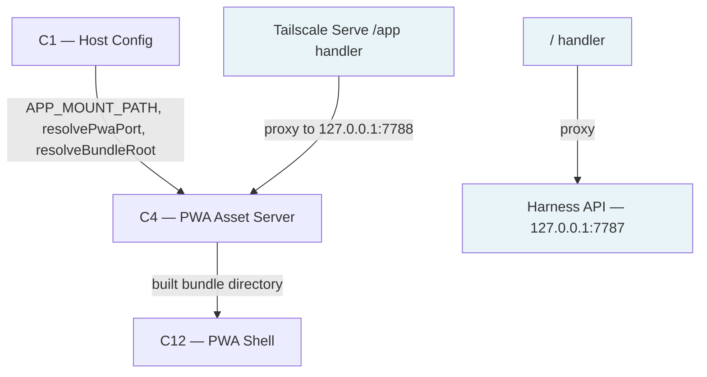

# As Built — M1

Baseline: 4980cb69531a0d60b7bada32c0402582c94d9f07
Change source: working tree (untracked files; no commits since baseline)

## Diagram

## Components Observed

| Id | Name | Files | Claimed? |
| --- | --- | --- | --- |
| C1 | Host Config | src/host/config.ts | Yes |
| C4 | PWA Asset Server | src/host/pwa-server.ts | Yes |
| C12 | PWA Shell | web/public/index.html, web/src/main.ts | Yes |

## Edges Observed

| From | To | What crosses | Evidence |
| --- | --- | --- | --- |
| C4 | C1 | APP_MOUNT_PATH, resolvePwaPort, resolveBundleRoot | src/host/pwa-server.ts line 11: `import { APP_MOUNT_PATH, resolveBundleRoot, resolvePwaPort } from "./config.ts"` |
| C4 | C12 | Built bundle directory | src/host/pwa-server.ts lines 168–170: `bundleRoot = options?.bundleRoot ?? resolveBundleRoot()` and line 174: `fetch: (request) => handleRequest(request, bundleRoot)` |
| build script | C12 | Compiled main.ts, copied public/ assets | scripts/build.ts lines 55–63: `Bun.build({ entrypoints: [resolve(root, "web", "src", "main.ts")], outdir: dist })`; lines 52: `copyDir(publicDir, dist)` |
| Tailscale Serve /app | C4 | HTTP proxy to 127.0.0.1:7788 | src/host/config.ts line 6: `APP_MOUNT_PATH = "/app"`; src/host/pwa-server.ts line 172: `hostname: "127.0.0.1", port` (default 7788) |

## Unmapped Files

| File | Why it could not be attributed |
| --- | --- |
| .gitignore | Repository configuration, not component implementation |
| package.json | Build/deployment configuration, not component implementation |
| tsconfig.json | TypeScript configuration, not component implementation |
| scripts/build.ts | Build tooling; implements C12 compilation but is not itself a component |
| deploy/install-serve.sh | Thin deployment wrapper for serve-install.ts; attributes to deployment tooling, not a component |
| src/host/serve-install.ts | Documented as a deviation in architecture.md (see below); part of deployment concern alongside C4/C13 |
| test/*.test.ts | Test code; covers C1, C4, C12, and serve-install but does not constitute them |

## Claim vs Observation

No mismatch. The milestone claimed C1, C4, C12, and all three are present in the diff.

**Deviation note:** Architecture.md records under `## Deviations` that `src/host/serve-install.ts` and `deploy/install-serve.sh` were added as code, contrary to the earlier statement that the Tailscale Serve `/app` mapping "is configuration, not code". The architecture explains: M1's acceptance criterion 3 requires the mapping to be "applied by a script in this repository that is safe to re-run". Both files exist and are present in the working tree. The architecture records `Material: no`, meaning no component boundary or ownership changed. Observation matches the declared deviation.
