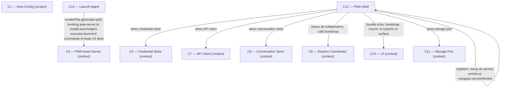

# As Built — M10

Baseline: 052db73fb28be6aff2699a57b5bdf2678d286fe9
Change source: working tree (git diff shows no tracked changes from baseline; all M10 work is untracked files and modifications)

## Diagram

## Components Observed

| Id | Name | Files | Claimed? |
| --- | --- | --- | --- |
| C12 | PWA Shell | web/public/index.html, web/public/app.webmanifest, web/public/icons/icon-192.png, web/public/icons/icon-512.png, web/public/icons/apple-touch-icon-180.png, web/src/sw.ts, web/src/main.ts, scripts/generate-icons.ts, scripts/build.ts, test/web/manifest.test.ts, test/web/sw.test.ts, test/icons.test.ts, test/build.test.ts | Yes |
| C13 | Launch Agent | src/host/launch-agent.ts, deploy/install-launch-agent.sh, test/host/launch-agent.test.ts | Yes |
| C4 | PWA Asset Server | src/host/pwa-server.ts (pre-existing, not changed in M10) | Implicit (C13 depends on it) |

## Edges Observed

| From | To | What crosses | Evidence |
| --- | --- | --- | --- |
| C12 | C10 | mount, createDomTarget, createActions, buildViewModel, toTelemetryDisplay | web/src/main.ts:1-11 imports all five from ./ui/; bootstrap() at line 39 calls mount() with injected target from createDomTarget(); line 18 re-exports all five |
| C12 | C9 | createSessionCoordinator, createConversation, listProfiles, setProfile, send, cancel, resumeIfInterrupted | web/src/main.ts:16 imports createSessionCoordinator; bootstrap() at line 34 calls createSessionCoordinator with apiClient and conversationStore; coordinator is passed to mount at line 41 |
| C12 | C8 | createConversationStore, loadConversations, saveConversation | web/src/main.ts:13 imports createConversationStore; bootstrap() at line 22 calls createConversationStore(storage); passed to createSessionCoordinator at line 34 and to mount at line 41 |
| C12 | C5 | createCredentialStore, getCredential, getToken | web/src/main.ts:14 imports createCredentialStore; bootstrap() at line 23 calls it; line 28 calls credentialStore.getCredential(); line 31 passes getToken closure to createApiClient |
| C12 | C7 | createApiClient, listProfiles | web/src/main.ts:15 imports createApiClient; bootstrap() at line 29 calls it with baseUrl and getToken; passed to createSessionCoordinator at line 34 |
| C12 | C11 | createLocalStorageStorage | web/src/main.ts:12 imports createLocalStorageStorage; bootstrap() at line 21 calls it with window.localStorage; storage is passed to createConversationStore and createCredentialStore |
| C12 | C12 | service worker registration | web/src/main.ts:54 calls navigator.serviceWorker.register("./sw.js"); web/src/sw.ts exports CACHE_NAME, handleShellRequest, shouldHandle, staleCacheNames; scripts/build.ts:73-85 builds web/src/sw.ts as format:"iife" into web/dist/sw.js |
| C13 | C4 | asset server lifecycle: plist with KeepAlive and RunAtLoad, launchctl bootstrap/enable/kickstart | src/host/launch-agent.ts:41-98 renderPlist generates plist with KeepAlive=true, RunAtLoad=true, invoking pwa-server.ts; installLaunchAgent at line 105-147 calls launchctl bootstrap/enable/kickstart to keep C4 alive |
| C4 | C1 | loopback port and mount path | src/host/pwa-server.ts:11 imports APP_MOUNT_PATH, resolvePwaPort, resolveBundleRoot from config.ts (pre-existing; already established in M1) |

## Unmapped Files

| File | Why it could not be attributed |
| --- | --- |
| src/host/m10-proof.ts | Proof script; tests the three derived criteria of M10 (manifest resolution, network-first cache, launch agent restart). Maps to the proof infrastructure, not a component. |
| package.json | Build configuration; added proof:m10 script. Not component code. |
| tsconfig.json | TypeScript configuration. Not component code. |
| scripts/build.ts | Build script that creates both main.js (ESM, line 55-63) and sw.js (IIFE, line 73-85). Maps to C12's build process but is infrastructure. |

## Location Departures (Noted in Instructions)

### C13 logic split across src/host and deploy/

**Observed and confirmed.** The architecture specifies C13 location as `deploy/` with responsibility to keep C4 alive. The implementation splits this:
- `src/host/launch-agent.ts` (189 lines) contains all substantive logic: `renderPlist` (lines 41-99, generates the property list with `KeepAlive` and `RunAtLoad`), `installLaunchAgent` (lines 105-147, executes all six launchctl commands), `uninstallLaunchAgent` (lines 150+, cleanup).
- `deploy/install-launch-agent.sh` (21 lines, executable) is a thin wrapper that resolves paths and invokes `bun run src/host/launch-agent.ts`.

This is the same pattern already recorded under M1's deviation entry ("a Tailscale Serve install script was added as code"), which noted `src/host/serve-install.ts` + `deploy/install-serve.sh` with identical structure. The dangerous `launchctl` invocations are testable through injected `exec` (LaunchAgentDeps at line 17-21), and the wrapper pattern is established C13 practice. No boundary moves, no ownership changes — C13 still owns keeping C4 alive.

### C12 service worker source is in web/src, not web/public/

**Observed and confirmed.** The architecture specifies C12 location as `web/public/` with responsibility including "service worker". The implementation:
- `web/src/sw.ts` (117 lines) is the source: exports `CACHE_NAME`, `shouldHandle`, `handleShellRequest`, `staleCacheNames`, environment-guarded `addEventListener` blocks (lines 87-120).
- `scripts/build.ts` emits this as `web/dist/sw.js` via a second `Bun.build` with `format: "iife"` (lines 73-85).
- `web/src/main.ts:54` registers it at `./sw.js` (served from `web/dist/` by C4).

This matches C12's agreed responsibility and interface: the service worker is part of "the document, manifest, icons and service worker" that make the app installable. The source location in `web/src/` is parallel to `web/src/main.ts` (the bundle entry) and reflects the build seam: bundle and worker are co-emitted from TypeScript source to `web/dist/` by two consecutive `Bun.build` calls. The agreed interface `C4 → C12` names "The built bundle directory", which C4 serves from `web/dist/`, and the directive `navigator.serviceWorker.register("./sw.js")` inside the built main.js correctly references it. No change to ownership, boundary, or technology — C12 still owns the worker logic, C4 still serves the bundle.

## Claim vs Observation

**Both claimed components observed; no undeclared new components.**

- **C4 (PWA Asset Server)** claimed, but **no M10 change**: `src/host/pwa-server.ts` and `test/host/pwa-server.test.ts` are pre-existing. M10 depends on C4 but does not build it; the asset server already exists from M1 and needs no modification to serve manifest, icons, and the service worker script emitted by the build.

- **C12 (PWA Shell)** claimed and fully observed: manifest (`web/public/app.webmanifest`), icons (three PNGs in `web/public/icons/`), service worker source (`web/src/sw.ts`), bundle entry (`web/src/main.ts` modified to register worker), build infrastructure (`scripts/build.ts` emits sw.js as IIFE), tests (manifest, sw, icons).

- **C13 (Launch Agent)** claimed and fully observed: plist generation and launchctl orchestration in `src/host/launch-agent.ts`, thin wrapper in `deploy/install-launch-agent.sh`, comprehensive tests in `test/host/launch-agent.test.ts`. The location split (src/host + deploy/) is noted above and is consistent with M1's established practice for C13 and other deployment utilities.

**No mismatch.** The three claimed components are all present. C4 required no change (already built in M1) so it appears only as a dependency of C13, marked as context. M10 adds no undeclared components.

---

## Notes

**Test and proof files** M10 includes extensive tests:
- `test/web/manifest.test.ts` — 56 lines, 7 tests asserting manifest parse, standalone display, icon links, asset paths, and absolute href/src forms
- `test/web/sw.test.ts` — 823 lines, 38 tests covering shouldHandle (origin, method, scope), handleShellRequest (network-first, cache strategies, offline fallback), staleCacheNames
- `test/icons.test.ts` — PNG structural validation (signature, chunk CRC, IHDR fields, IDAT decompression), PNG generation determinism, and checked-in icon drift check
- `test/host/launch-agent.test.ts` — plist path construction, XML escaping, launchctl command orchestration with injected exec
- `test/build.test.ts` modified — added assertion at line 95-97 that `web/dist/sw.js` is a valid IIFE and contains no ES module exports

**Proof:** `src/host/m10-proof.ts` (220+ lines) mechanically demonstrates three derived criteria: manifest and icons resolve at the served origin, the service worker uses network-first strategy (proven by rebuilding and fetching), and the launch agent restarts the asset server (proven by kill and re-entry).

**Cycle 2 corrections** applied (2026-08-31). The patch `.harness/reviews/M10-cycle2.patch` corrects three findings:
- `web/src/sw.ts:46-75` — cache write failures inside the outer try/catch block were discarding successful network responses. Wrapped cachePut in an inner try/catch (lines 51-58) to protect successful responses.
- `web/public/index.html` — asset href/src attributes changed from relative (`./app.webmanifest`, `./main.js`) to absolute (`/app/app.webmanifest`, `/app/main.js`) to ensure correct resolution regardless of how the document is loaded.
- `test/icons.test.ts` — two unrooted `generateIcons()` calls changed to pass `{ root: tmpDir }`, and a new drift-check test added comparing checked-in icons against fresh generation.
- `test/web/manifest.test.ts` — three assertions updated to the new absolute paths.

All M10 files in the working tree reflect these corrections. Cycle 1 pre-correction state was snapshot at `348e4e5d`, post-correction at `90bef344`.
