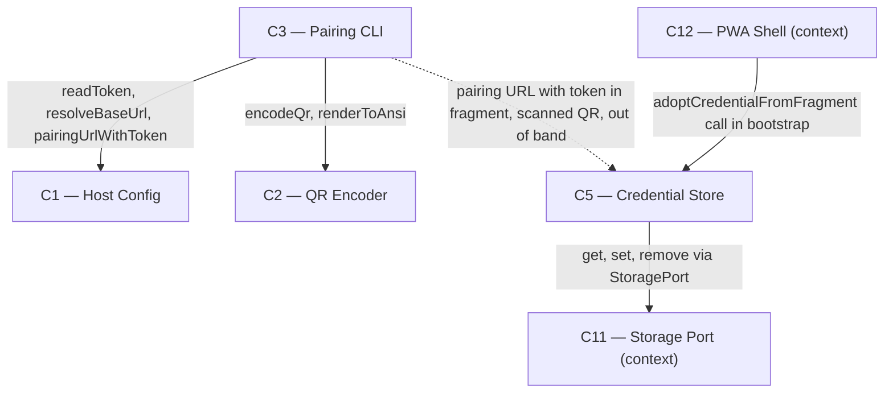

# As Built — M11

Baseline: 052db73fb28be6aff2699a57b5bdf2678d286fe9
Change source: both (git diff 052db73..HEAD: 2 tracked additions; working tree: untracked files for all other M11 work)

## Diagram



## Components Observed

| Id | Name | Files | Claimed? |
| --- | --- | --- | --- |
| C1 | Host Config | src/host/config.ts (modified), test/host/config.test.ts | Yes |
| C2 | QR Encoder | src/qr/reed-solomon.ts, src/qr/types.ts, src/qr/encode.ts, src/qr/tables.ts, src/qr/png.ts, src/qr/render.ts, test/qr/reed-solomon.test.ts, test/qr/png.test.ts, test/qr/encode.test.ts, test/qr/render.test.ts, scripts/png.ts (shared utility) | Yes |
| C3 | Pairing CLI | src/host/pair.ts, test/host/pair.test.ts | Yes |
| C5 | Credential Store | web/src/credential-store.ts (modified), web/src/location-port.ts (new), test/web/credential-store.test.ts, test/web/location-port.test.ts | Yes |

## Edges Observed

| From | To | What crosses | Evidence |
| --- | --- | --- | --- |
| C3 | C1 | readToken, resolveBaseUrl, pairingUrlWithToken | src/host/pair.ts:1-2 imports all three from ./config.ts; main() at line 35-36 calls readToken() and resolveBaseUrl(); renderPairing() at line 13 calls pairingUrlWithToken() |
| C3 | C2 | encodeQr, renderToAnsi | src/host/pair.ts:2-3 imports encodeQr from ../qr/encode.ts and renderToAnsi from ../qr/render.ts; renderPairing() at line 17-18 calls both |
| C3 | C5 | pairing URL fragment (out of band) | src/host/pair.ts:13-15 constructs pairing URL with token in fragment (#t=<token>); C5's credential-store.ts:85-120 adoptCredentialFromFragment() parses and adopts from fragment |
| C5 | C11 | get, set, remove | web/src/credential-store.ts:23-83 createCredentialStore takes StoragePort and calls storage.get() line 26, storage.set() line 76, storage.remove() line 80 |
| C12 | C5 | adoptCredentialFromFragment call | web/src/main.ts:22,27,74 imports adoptCredentialFromFragment and createWindowLocation; bootstrap() at line 74 calls adoptCredentialFromFragment(credentialStore, location) before constructing API client |

## Unmapped Files

| File | Why it could not be attributed |
| --- | --- |
| src/host/m11-proof.ts | Proof script demonstrating acceptance criteria; maps to proof infrastructure, not a component. Tests the built bundle's bootstrap and pairing flow. |
| test/web/main-bootstrap.test.ts | Unit tests for bootstrap() with dependency injection; proof infrastructure testing the ordering of adoption before API client construction. |
| test/web/bundle-fragment.test.ts | Integration test verifying the built bundle contains and executes fragment-capture code; caught regression where tree-shaking dropped the adoption call. |
| web/src/main.ts | Bundle entry point (C12 — PWA Shell), wired in M10; M11 modifies it to add adoption call. Belongs to C12, not a new component. |
| package.json | Build configuration; added "pair" and "proof:m11" scripts. Infrastructure, not component code. |
| scripts/qr-decode.swift | Independent test oracle using Apple Vision framework to decode QR codes; used by proof scripts, not part of the shipped system. |

## Claim vs Observation

**All claimed components observed; no mismatch.**

- **C1 (Host Config)** claimed and fully observed: `pairingUrlWithToken()` added to config.ts, imported by C3's pair.ts and used to construct the pairing URL with token in fragment.

- **C2 (QR Encoder)** claimed and fully observed: Six new modules implementing Reed-Solomon error correction, QR encoding, table data, PNG rendering, and ANSI rendering, with comprehensive tests covering all stages of the QR pipeline from data to rendered output.

- **C3 (Pairing CLI)** claimed and fully observed: New pair.ts main CLI that reads token via C1, encodes pairing URL via C2, renders QR and base URL, and prints only the base URL (never the pairing URL carrying the credential). Tests verify CLI output structure and token-leak prevention.

- **C5 (Credential Store)** claimed and fully observed: Added `adoptCredentialFromFragment(store, location)` to credential-store.ts, which parses the URL fragment, persists the token through C11, and clears the hash. New location-port.ts implements the LocationPort adapter for `window.location`, and new web/src/main.ts bootstrap modification wires adoption before API client construction (phase 3 AC2 correction). Tests cover all adoption paths and edge cases.

**Note on LocationPort:** The architecture's Deviations section records the LocationPort adapter (web/src/location-port.ts and the wiring in main.ts) as a non-material deviation. It was added in M11's phase 3 to fix the fragment-capture wiring that was tree-shaken out of the phase 1-2 implementation. It is a port implementation for C5 (paralleling C11's StoragePort), changes no boundary or ownership, and is already accounted for in the architecture record.

---

## Notes

**Three-phase delivery and AC2 falsification:** M11 ran in phases 1-2 (QR encoder T1-T7, pairing CLI, credential adoption), then phase 3 was added after AC2 was falsified on device (2026-09-01). The falsification was caused by the adoption call being omitted from bootstrap() — `adoptCredentialFromFragment` existed in source but the bundler tree-shook it out because nothing invoked it, so the shipped app had no fragment-capture code at all. Phase 3 fixed the wiring and added three layers of proof that discriminate the broken state:

1. `test/web/main-bootstrap.test.ts` — calls bootstrap() with injected ports and verifies adoption, hash clearing, and correct ordering (API client gets adopted base URL, not empty string)
2. `test/web/bundle-fragment.test.ts` — builds the bundle and asserts both statically (call site present) and behaviorally (adoption works against built main.js)
3. `src/host/m11-proof.ts` Phase 2 (rewritten) — imports the built bundle and proves adoption against the live harness with authenticated call to /v1/profiles → 200

The optical camera scan step of AC2 is deferred to M14 and is not an M11 criterion; AC2's agent-provable half (credential extraction, fragment clearing, live authentication) is now proven against the shipped bundle.

**QR encoder verification:** The 40-version × 4-ECC-level encoder is independently verified by Apple's Vision framework (scripts/qr-decode.swift), which runs the same decoding stack as the iPhone camera. Phase 1 verified a v6 pairing URL (43-character token) decodes byte-identically. No external QR library is used; the encoder is built from the specification and checked by reverse-reading the codeword stream and verifying Reed-Solomon parity across all combinations.

**File count and change set:**
- git diff 052db73: 2 tracked additions (m11-proof.ts, bundle-fragment.test.ts)
- Working tree untracked: 23 files (QR encoder, pairing CLI, credential adoption, tests, build utilities)
- Total attributed: 25 files, all outside .harness/

**Files this milestone changed (from evidence):**

Phase 1-2:
```
new   src/qr/reed-solomon.ts               new   test/qr/reed-solomon.test.ts
new   src/qr/types.ts                      new   test/qr/png.test.ts
new   src/qr/encode.ts                     new   test/qr/encode.test.ts
new   src/qr/tables.ts                     new   test/qr/render.test.ts
new   src/qr/png.ts                        mod   src/host/config.ts
new   src/qr/render.ts                     mod   test/host/config.test.ts
new   src/host/pair.ts                     mod   web/src/credential-store.ts
new   test/host/pair.test.ts               mod   test/web/credential-store.test.ts
new   src/host/m11-proof.ts                mod   package.json (scripts: pair, proof:m11)
new   scripts/png.ts
new   scripts/qr-decode.swift
```

Phase 3 (AC2 Correction):
```
new   web/src/location-port.ts             new   test/web/main-bootstrap.test.ts
mod   web/src/main.ts                      new   test/web/location-port.test.ts
mod   src/host/m11-proof.ts (Phase 2)      new   test/web/bundle-fragment.test.ts
```

**Safety:** The real token file `~/.openweight-harness/token` (mode 0600, 44 bytes) was never modified. All permission-refusal proofs ran against fixtures under temp directories. No dependencies added to package.json. The pairing QR and URL fragment never appear in logged output; all proof script stdout was audited against the real token with zero 8-character window matches.
