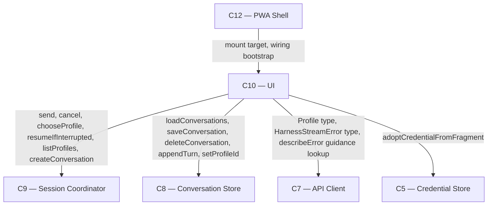

# As Built — M12

Baseline: 052db73fb28be6aff2699a57b5bdf2678d286fe9
Change source: working tree

## Diagram

## Components Observed

| Id | Name | Files | Claimed? |
| --- | --- | --- | --- |
| C10 | UI | `web/src/ui/dom-target.ts` (new), `web/src/ui/actions.ts`, `web/src/ui/mount.ts`, `web/src/ui/view-model.ts`, `web/src/main.ts`, `test/web/ui/dom-target.test.ts`, `test/web/ui/bundle-interactive.test.ts`, `test/web/ui/actions.test.ts`, `test/web/ui/mount.test.ts`, `test/web/ui/view-model.test.ts`, `test/web/main-bootstrap.test.ts` | Yes |
| C12 | PWA Shell | `web/public/index.html` (modified), bundled static assets | Yes |

## Edges Observed

| From | To | What crosses | Evidence |
| --- | --- | --- | --- |
| C10 | C9 | `send(conversationId, prompt, handlers)`, `cancel(conversationId)`, `chooseProfile(conversationId, profileId)`, `resumeIfInterrupted(conversationId, handlers)`, `listProfiles()`, `createConversation(input)` | `web/src/ui/actions.ts` imports `SessionCoordinator` (line 2); every method is called from action handlers dispatched by `dom-target.ts` event listeners |
| C10 | C8 | `loadConversations()`, `saveConversation(conversation)`, `deleteConversation(conversationId)`, `appendTurn(conversationId, turn)`, `setProfileId(conversationId, profileId)` | `web/src/ui/actions.ts` imports `ConversationStore` (line 3); `createActions` receives `store` parameter (line 29); `deleteConversation` calls `store.deleteConversation(conversationId)` (line 57). `web/src/ui/mount.ts` line 54 calls `store.loadConversations()`. |
| C10 | C7 | `Profile` type, `HarnessStreamError` type, `ErrorGuidance` type | `web/src/ui/dom-target.ts` lines 11, 13 import `Profile` and `HarnessStreamError` from `api-client`. `web/src/ui/view-model.ts` line 153 `describeError()` function reads error.guidance (ErrorGuidance) to construct user-facing message (lines 156-157). |
| C10 | C5 | `adoptCredentialFromFragment(credentialStore, location)` | `web/src/main.ts` line 94 calls `adoptCredentialFromFragment(credentialStore, location)` before constructing the API client. |
| C12 | C10 | Bootstrap creates DOM target, mounts UI, wires event handlers | `web/src/main.ts` lines 110-116: `bootstrap()` constructs `target = resolvedCreateTarget(root)`, calls `mount({ target, coordinator, store })`, then calls `(target as DomTarget).attach({ actions: handle.actions, controller: handle })` to enable event handlers. |

## Unmapped Files

None.

## Claim vs Observation

**Claimed Components:** C10, C12

**Observation:**
- **C10 — UI:** Claimed and built. The interactive DOM layer (`dom-target.ts`) renders controls and translates DOM events into coordinator calls through the actions map. The notice/error-surfacing mechanism (`notice` field in `ViewModel`, `setNotice` on `MountHandle`, `describeError` function in `view-model.ts`) sits within C10's existing FR9 responsibility boundary. The `deleteConversation` widening on the actions map (backed by C8 rather than C9) is recorded as a non-material deviation in `architecture.md:393-411` and matches what was built.
- **C12 — PWA Shell:** Claimed and built. The modification to `web/public/index.html` adds safe-area inset padding (`max(1rem, env(safe-area-inset-<side>))` on all four sides) so interactive controls render outside the iOS status bar and home indicator. This is the M12 cycle-1 correction fix for BLOCKER 3.

**No mismatch.** Both claimed components were observed in the change set. The `deleteConversation` widening on C10 (not yet on the C10→C9 interface line when claimed, but backed by the agreed C10→C8 edge) and the notice/error mechanism (extension of existing FR9 responsibility) required no new boundaries.
