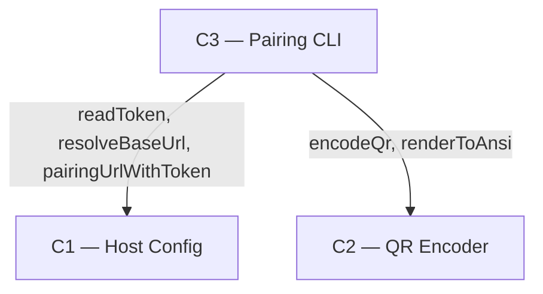

# As Built — M12a-i

Baseline: 052db73fb28be6aff2699a57b5bdf2678d286fe9
Change source: working tree

## Diagram

## Components Observed

| Id | Name | Files | Claimed? |
| --- | --- | --- | --- |
| C1 | Host Config | `src/host/config.ts` | Context (pre-existing) |
| C2 | QR Encoder | `src/qr/encode.ts`, `src/qr/render.ts` | Context (pre-existing) |
| C3 | Pairing CLI | `src/host/pair.ts`, `test/host/pair.test.ts` | Yes |

## Edges Observed

| From | To | What crosses | Evidence |
| --- | --- | --- | --- |
| C3 | C1 | `readToken()`, `resolveBaseUrl()`, `pairingUrlWithToken()` | `src/host/pair.ts` line 1: `import { readToken, resolveBaseUrl, pairingUrlWithToken } from "./config.ts"` |
| C3 | C2 | `encodeQr()`, `renderToAnsi()` | `src/host/pair.ts` lines 2–3: `import { encodeQr } from "../qr/encode.ts"; import { renderToAnsi } from "../qr/render.ts"` |

## Unmapped Files

None.

## Claim vs Observation

Claim stated: "C3 (Pairing CLI) realised, reading C1 (Host Config) via `readToken` / `resolveBaseUrl`."

Observation: C3 is realised and reads C1, but via three functions: `readToken`, `resolveBaseUrl`, **and** `pairingUrlWithToken`. The claim listed only two of the three C1 interfaces C3 imports and uses. `pairingUrlWithToken` constructs the full pairing URL with the token embedded in the fragment (line 96 in `config.ts`), which C3 calls on line 14 of `pair.ts` before encoding it to QR. This is not a boundary change—all three are already functions exported from the C1 module—but the claim's enumeration of C1's surface was incomplete.

No new component observed. No new boundary observed beyond the claimed C3 → C1 and C3 → C2.
