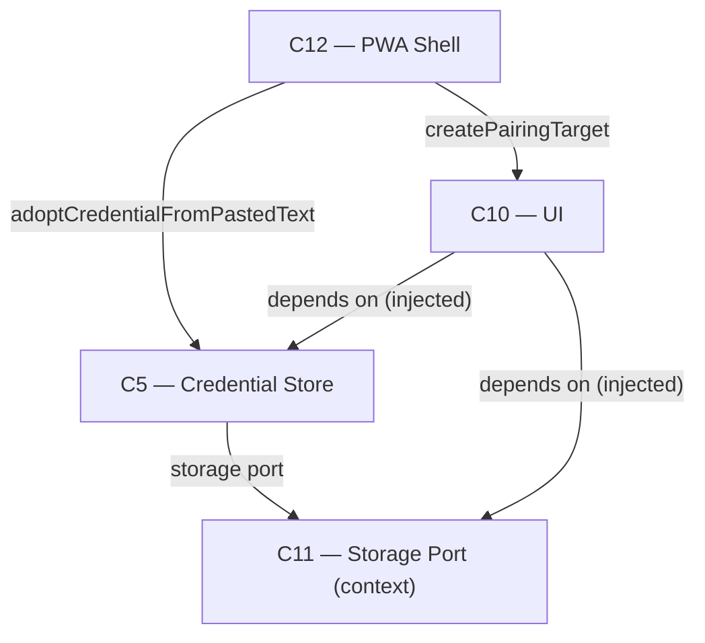

# As Built — M12a-ii

Baseline: `052db73fb28be6aff2699a57b5bdf2678d286fe9`
Change source: working tree (both staged and untracked files; `git diff 052db73..HEAD` shows no commits since baseline)

## Diagram

## Components Observed

| Id | Name | Files | Claimed? |
| --- | --- | --- | --- |
| C5 | Credential Store | `web/src/credential-store.ts` | Yes |
| C10 | UI | `web/src/ui/pairing-target.ts` (new), `web/src/ui/dom-target.ts` (modified) | Yes |
| C12 | PWA Shell | `web/src/main.ts` | Yes |

## Edges Observed

| From | To | What crosses | Evidence |
| --- | --- | --- | --- |
| C12 | C5 | `adoptCredentialFromPastedText` and `adoptCredentialFromFragment` | `web/src/main.ts` lines 27–28 import these functions; line 247 calls `adoptCredentialFromPastedText(credentialStore, pastedText, location.origin)` |
| C12 | C10 | `createPairingTarget` function | `web/src/main.ts` lines 35–38 import `createPairingTarget`; line 240 calls `createPairingTarget(root, { onSubmit })` with a callback bound to C5 adoption logic |

## Unmapped Files

| File | Why it could not be attributed |
| --- | --- |
| `test/web/ui/pairing-target.test.ts` | Test file for C10 module, not a component itself |
| `test/web/start-app.test.ts` | Test file for C12 entry point, not a component itself |
| `test/web/bundle-fragment.test.ts` | Test file modified with new test case for `startApp`; not a component itself |
| `src/host/m12a-proof.ts` | Proof-of-concept executable demonstrating pairing workflows; not a component of the app itself |

## Claim vs Observation

**Claimed:** C5 gained `adoptCredentialFromPastedText`, delegating to `adoptCredentialFromFragment`.
**Observed:** ✓ Confirmed. `web/src/credential-store.ts` lines 122–163 define `adoptCredentialFromPastedText`, which calls `adoptCredentialFromFragment` on line 147 (for parsed URL case) and line 162 (for bare-token case).

**Claimed:** C10 gained `ui/pairing-target.ts`, a second DOM-touching module.
**Observed:** ✓ Confirmed. New file `web/src/ui/pairing-target.ts` lines 22–94 define `createPairingTarget`, which renders the pairing form to the DOM. Comments (lines 1–5) explicitly note it is the second DOM-touching module in web/src/ alongside `dom-target.ts`.

**Claimed:** C12 gained `startApp`, which owns the unpaired → paired → unauthorized → unpaired state machine and replaced `bootstrap(root)` in the browser entry guard.
**Observed:** ✓ Confirmed. `web/src/main.ts` lines 186–285 define `startApp(root, deps?)`, implementing the state machine. The function manages `mountHandle` and `pairingTarget` variables (lines 207–208), with state transitions via `enterPaired()` (lines 218–235), `enterUnpaired()` (lines 237–244), and `onUnauthorized()` (lines 263–266). The browser entry guard at lines 287–301 calls `startApp(root)` instead of `bootstrap(root)`.

**Claimed:** No new edge was introduced; C10's `pairing-target.ts` is credential-free (no imports at all, taking an `onSubmit` callback instead).
**Observed:** ✓ Confirmed. `web/src/ui/pairing-target.ts` contains no import statements. It defines a dependency object `PairingTargetDeps` (lines 9–11) with a single method `onSubmit(pastedText: string)`, which is supplied by the caller (C12 in `web/src/main.ts` line 240). The C10 module never imports or references `credential-store`. The credential adoption logic is defined and wired in C12, not in C10.

**Claimed:** The component that reaches C5 is C12 (`web/src/main.ts`), and that C12 → C5 wiring is already recorded in the M11 deviation entry.
**Observed:** ✓ Confirmed. C12 reaches C5 via `adoptCredentialFromPastedText` (new in this milestone, lines 247–250) and `adoptCredentialFromFragment` (already in M11, lines 202 and 94). Both paths wire to the same credential store.

**No mismatch.**
