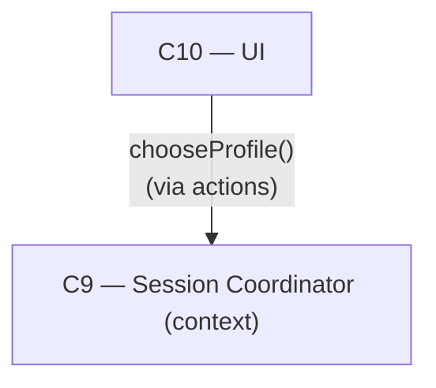

# As Built — M12b

Baseline: 052db73fb28be6aff2699a57b5bdf2678d286fe9
Change source: working tree

## Diagram

## Components Observed

| Id | Name | Files | Claimed? |
| --- | --- | --- | --- |
| C10 | UI | web/src/ui/dom-target.ts test/web/ui/dom-target.test.ts | Yes |

## Edges Observed

| From | To | What crosses | Evidence |
| --- | --- | --- | --- |
| C10 | C9 | chooseProfile(conversationId, profileId) | web/src/ui/dom-target.ts:201 calls d.actions.chooseProfile(), implemented in web/src/ui/actions.ts:40-41 as coordinator.setProfile() |

## Unmapped Files

| File | Why it could not be attributed |
| --- | --- |
| src/host/m12b-proof.ts | Attestation file demonstrating M12b acceptance criteria; no product component owns attestation responsibility |
| package.json | Build/tooling file; adds proof:m12b npm script |

## Claim vs Observation

No mismatch. M12b's claimed architecture realises C10 and C12. Observed: C10 is realised by the profile select's change handler (lines 190-207 in dom-target.ts) gaining `.then(() => controller.render())` and `.catch(err => controller.setNotice(describeError(err)))`, backed by four new unit tests under M12b-T1 (test/web/ui/dom-target.test.ts:1386-1726) that demonstrate the profile selection persists, renders without manual intervention, and surfaces errors. C12 (PWA Shell) is not touched in this milestone. The edge from C10 to C9 (via actions.chooseProfile) existed in M9; M12b adds the success/error handling in the DOM event listener.
