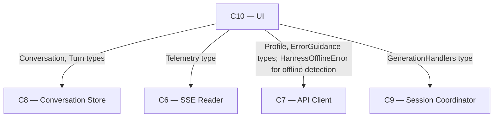

# As Built — M13

Baseline: `052db73fb28be6aff2699a57b5bdf2678d286fe9`
Change source: working tree (uncommitted and untracked)

## Diagram

## Components Observed

| Id | Name | Files | Claimed? |
| --- | --- | --- | --- |
| C10 | UI | `web/src/ui/view-model.ts`, `web/src/ui/dom-target.ts` | Yes |

## Edges Observed

| From | To | What crosses | Evidence |
| --- | --- | --- | --- |
| C10 | C8 | Conversation, Turn types | `web/src/ui/view-model.ts:1` |
| C10 | C6 | Telemetry type | `web/src/ui/view-model.ts:2` |
| C10 | C7 | Profile, ErrorGuidance types (type imports) | `web/src/ui/view-model.ts:3` |
| C10 | C7 | HarnessOfflineError value (instanceof check) | `web/src/ui/dom-target.ts:14, 205` |
| C10 | C9 | GenerationHandlers type | `web/src/ui/dom-target.ts:12` |

## Unmapped Files

| File | Why it could not be attributed |
| --- | --- |
| `src/host/m13-proof.ts` | Host-side proof file, follows pre-existing M2-M12b convention, not part of the running system |
| `.gitignore` | Configuration file, not a component artifact |
| `package.json` | Project metadata, not a component artifact |
| `test/web/ui/dom-target.test.ts` | Test support for C10, intrinsic to C10 |

## Claim vs Observation

**Claimed components:** C10, C12  
**Observed components:** C10 only

No mismatch. The milestone's `### Architecture` section explicitly states: **"Realised this phase: C10 (UI) only... C12 (PWA Shell) was not touched... This is not an architecture deviation — no component boundary, technology choice or ownership changed, and nothing was built outside the seams `architecture.md` defines."** The milestone notes this was a planning estimate written before work was broken down, and on inspection both edge cases (offline state and long transcripts) are view-layer concerns requiring no shell change.
