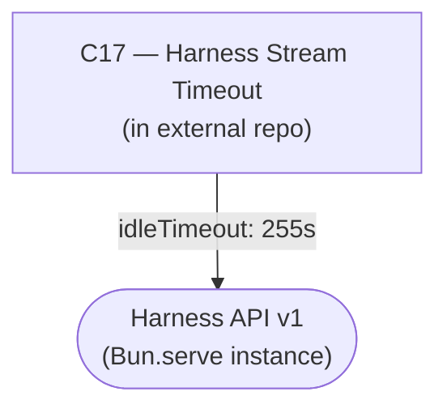

# As Built — M15

Baseline: `052db73fb28be6aff2699a57b5bdf2678d286fe9` on `/Users/ryankenny/Projects/phoneToLocalModel` + `65c1fdee1b01ebe288456dfeaa74af083bcc9dfe` on `/Users/ryankenny/Projects/OpenCodeOpenWeightHarness`
Change source: working tree (phoneToLocalModel); working tree (OpenCodeOpenWeightHarness)

## Diagram

## Components Observed

| Id | Name | Files | Claimed? |
| --- | --- | --- | --- |
| C17 | Harness Stream Timeout | `harness/api/server.ts` (modified), `harness/api/idle-timeout.test.ts` (new) | Yes |

## Edges Observed

| From | To | What crosses | Evidence |
| --- | --- | --- | --- |
| C17 | Harness API | `idleTimeout: 255s` set on `Bun.serve` | `harness/api/server.ts:191` — `idleTimeout: HARNESS_IDLE_TIMEOUT_SECONDS,` in the `Bun.serve` call options |

## Unmapped Files

| File | Why it could not be attributed |
| --- | --- |
| `/Users/ryankenny/Projects/phoneToLocalModel/src/host/m15-proof.ts` | Live proof file; proves the fix against a running harness but modifies no component in this repository. Untracked in phoneToLocalModel. |
| `/Users/ryankenny/Projects/phoneToLocalModel/package.json` (line added: `"proof:m15"`) | Test harness configuration for the proof script; modifies no component architecture. Untracked in phoneToLocalModel. |

## Claim vs Observation

### Alignment
**Claimed:** "No component in this repository changes."
**Observed:** Correct. All changes are in the external `OpenCodeOpenWeightHarness` repository implementing C17. The phoneToLocalModel repository contains only untracked proof and configuration files; no components are modified.

**Claimed:** "C17 — Harness Stream Timeout. Realised, in the external repository."
**Observed:** Correct. C17 is fully realised in `harness/api/server.ts` and `harness/api/idle-timeout.test.ts` within the external repository.

### Observation Not Addressed in Claim
The module comment in `harness/api/server.ts` was substantially expanded to explain the one deliberate divergence from `security/auth/surface.ts` (the `idleTimeout` setting). This expansion moved the `Bun.serve` call site from line 150 in the baseline to line 182 in the working tree — a delta of 32 lines. The milestone's baseline instruction stated: "If the harness's `Bun.serve` call site has moved from `harness/api/server.ts:150`, record that under `## Deviations`..." This movement has occurred. The change is purely in documentation and line numbers, with no modification to the `Bun.serve` call's semantics or options beyond the addition of `idleTimeout` itself (which is the entire point of C17).
