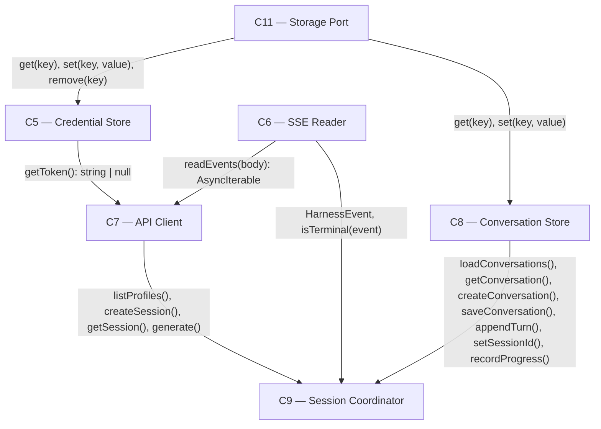

# As Built — M2

Baseline: 4980cb69531a0d60b7bada32c0402582c94d9f07
Change source: working tree (untracked files; no commits since baseline)

## Diagram

## Components Observed

| Id | Name | Files | Claimed? |
| --- | --- | --- | --- |
| C5 | Credential Store | web/src/credential-store.ts | Yes |
| C6 | SSE Reader | web/src/sse-reader.ts | Yes |
| C7 | API Client | web/src/api-client.ts | Yes |
| C8 | Conversation Store | web/src/conversation-store.ts | Yes |
| C9 | Session Coordinator | web/src/session-coordinator.ts | Yes |
| C11 | Storage Port | web/src/storage-port.ts | Yes |

## Edges Observed

| From | To | What crosses | Evidence |
| --- | --- | --- | --- |
| C5 | C11 | `get(key): string \| null`, `set(key, value): void`, `remove(key): void` | web/src/credential-store.ts line 1: `import type { StoragePort } from "./storage-port"` and calls at lines 20, 70, 74 |
| C8 | C11 | `get(key): string \| null`, `set(key, value): void` | web/src/conversation-store.ts line 1: `import type { StoragePort }` and calls at lines 52, 74 |
| C7 | C6 | `readEvents(body: ReadableStream): AsyncIterable<HarnessEvent>` | web/src/api-client.ts line 1: `import { readEvents, type HarnessEvent } from "./sse-reader"` and call at line 239 |
| C7 | C5 | `getToken(): string \| null` | web/src/api-client.ts line 96: `const token = getToken()` where `getToken` is a callback from CreateApiClientOptions; used at line 105 to set Authorization header |
| C9 | C7 | `listProfiles(): Promise<Profile[]>`, `createSession(): Promise<string>`, `getSession(sessionId): Promise<SessionSnapshot>`, `generate(sessionId, options): Promise<{generationId, events}>` | web/src/session-coordinator.ts lines 1–4: `import type { ApiClient, HarnessApiError } from "./api-client"` and calls at lines 45, 63, 68, 169 |
| C9 | C8 | `loadConversations(): Conversation[]`, `getConversation(id): Conversation \| null`, `createConversation(input): Conversation`, `saveConversation(conversation): void`, `appendTurn(conversationId, turn): Conversation`, `setSessionId(conversationId, sessionId): Conversation`, `recordProgress(conversationId, pending): Conversation` | web/src/session-coordinator.ts lines 5–8: `import type { ConversationStore, Conversation } from "./conversation-store"` and calls at lines 54, 64, 128–129, 146, 151, 160 |
| C9 | C6 | `HarnessEvent` type, `isTerminal(event): boolean` | web/src/session-coordinator.ts lines 9–10: `import type { HarnessEvent, Telemetry } from "./sse-reader"` and `import { isTerminal } from "./sse-reader"`, used at lines 89, 134 |

## Unmapped Files

| File | Why it could not be attributed |
| --- | --- |
| .gitignore | Repository configuration, not component implementation |
| package.json | Build/deployment configuration; contains proof:m2 script reference but the script file itself is the proof artifact |
| tsconfig.json | TypeScript configuration, not component implementation |
| src/host/m2-proof.ts | Host-side proof/integration test that orchestrates the phone-side components; analogous to a test, not a shipped component |
| test/web/storage-port.test.ts | Unit test code; covers C11 but does not constitute it |
| test/web/sse-reader.test.ts | Unit test code; covers C6 but does not constitute it |
| test/web/credential-store.test.ts | Unit test code; covers C5 but does not constitute it |
| test/web/conversation-store.test.ts | Unit test code; covers C8 but does not constitute it |
| test/web/api-client.test.ts | Unit test code; covers C7 but does not constitute it |
| test/web/session-coordinator.test.ts | Unit test code; covers C9 but does not constitute it |

## Claim vs Observation

No mismatch.

All six claimed components (C5, C6, C7, C8, C9, C11) are present in the working tree. 

**Partial implementation verification:**
- C7 (API Client) correctly implements only `listProfiles()`, `createSession()`, `getSession()`, and `generate()`. Methods `appendTurn()`, `cancel()`, and `resumeEvents()` are not present, consistent with the claim that they are deferred to M4/M5/M6.
- C5 (Credential Store) holds credentials in `setCredential()` and retrieves them via `getToken()` and `getCredential()`, but does not implement URL fragment capture. The architecture says fragment capture is deferred to M11/AC2; this milestone's implementation is consistent with that deferral. The m2-proof.ts sets the credential programmatically, not from a URL.
- C9 (Session Coordinator) correctly implements only `send()`. Methods `cancel()` and `resumeIfInterrupted()` are not present, consistent with the claim that they are deferred to M4/M5/M6.
