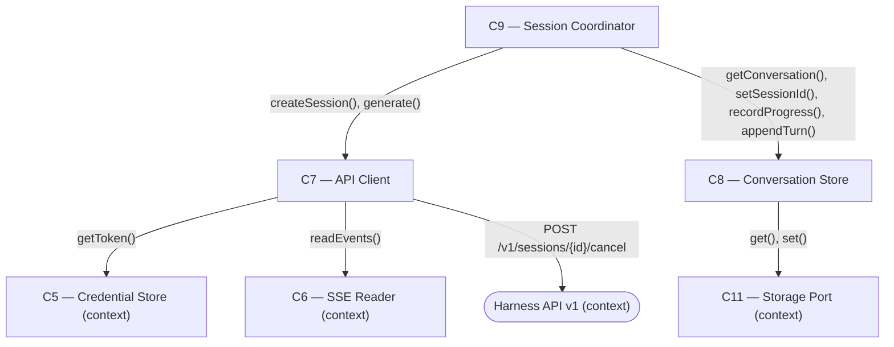

# As Built — M3

Baseline: `4980cb69531a0d60b7bada32c0402582c94d9f07`
Change source: working tree

## Diagram

## Components Observed

| Id | Name | Files | Claimed? |
| --- | --- | --- | --- |
| C7 | API Client | `web/src/api-client.ts` | Yes |
| C8 | Conversation Store | `web/src/conversation-store.ts` | Yes |
| C9 | Session Coordinator | `test/web/session-coordinator.test.ts` (extended) | Yes |

## Edges Observed

| From | To | What crosses | Evidence |
| --- | --- | --- | --- |
| C7 | C6 | `readEvents(body: ReadableStream)` | `web/src/api-client.ts` line 1 imports from sse-reader; line 240 calls `readEvents(response.body)` in `generate()` |
| C7 | C5 | `getToken(): string \| null` | `web/src/api-client.ts` line 97 calls `getToken()` in `makeRequest()`; callback injected at creation time |
| C7 | API | POST `/v1/sessions/{id}/generations/{id}/cancel` | `web/src/api-client.ts` lines 248–251 new `cancel()` method makes POST request with `makeRequest()` |
| C8 | C11 | `get(key), set(key, value)` | `web/src/conversation-store.ts` line 1 imports StoragePort; lines 53–56 call `storage.get()`; lines 74–76 call `storage.set()` (existing); new `setProfileId()` at lines 180–191 also calls `persist()` which calls `storage.set()` |
| C9 | C7 | `createSession(), generate(sessionId, { profileId, prompt })` | `web/src/session-coordinator.ts` line 4 imports ApiClient; line 63 calls `apiClient.createSession()`; line 68 calls `apiClient.generate()` with `conversation.profileId` |
| C9 | C8 | `getConversation(), setSessionId(), recordProgress(), appendTurn()` | `web/src/session-coordinator.ts` line 8 imports ConversationStore; line 54 calls `getConversation()`; line 64 calls `setSessionId()`; lines 74, 128, 146 call `recordProgress()`; lines 151, 160 call `appendTurn()` |

## Unmapped Files

| File | Why it could not be attributed |
| --- | --- |
| `src/host/m3-proof.ts` | Proof/test harness for M3 validation at the host level. Exercises C5, C7, C8, C9 to demonstrate runtime profile selection and discovery, but is not itself a component. Follows the pattern established by `src/host/m2-proof.ts` in M2. |
| `test/no-hardcoded-profile-ids.test.ts` | Standing guard test that verifies no live profile IDs (`reasoning-baseline`, `reasoning-capable`, `reasoning-deep`) appear as literals in source files. Validation infrastructure rather than a component. |
| `package.json` | Build script configuration (added `"proof:m3": "bun run src/host/m3-proof.ts"`). Not a component; tooling only. |

## Claim vs Observation

No mismatch.

- **C7** (claimed): Observed. `web/src/api-client.ts` modified to add `cancel(sessionId, generationId)` method (lines 244–267), already named in the agreed `C9 → C7` interface.
- **C8** (claimed): Observed. `web/src/conversation-store.ts` modified to add `setProfileId(conversationId, profileId)` method (lines 180–191), following the existing `setSessionId()` pattern.
- **C9** (claimed): Observed. Tests extended (`test/web/session-coordinator.test.ts`); source code unchanged. Existing edges to C7 and C8 are now verified by tests pinning the behaviour that M3 depends on (reading `conversation.profileId` at send time, propagating `HarnessApiError` from `generate()`).

All three claimed components appear in the diff. No observed components were unclaimed.
