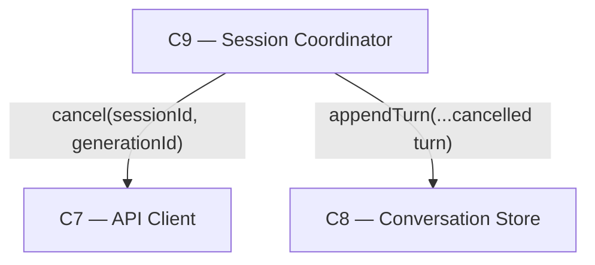

# As Built — M4

Baseline: `0e310db905b46b5de4d86ad074ecf80cf982da43` (pre-M4 tree)
Change source: working tree (uncommitted)

## Diagram

## Components Observed

| Id | Name | Files | Claimed? |
| --- | --- | --- | --- |
| C7 | API Client | web/src/api-client.ts (no change) | Yes |
| C8 | Conversation Store | web/src/conversation-store.ts (no change) | Yes |
| C9 | Session Coordinator | web/src/session-coordinator.ts | Yes |

## Edges Observed

| From | To | What crosses | Evidence |
| --- | --- | --- | --- |
| C9 | C7 | `cancel(sessionId, generationId): Promise<{status: string}>` | web/src/session-coordinator.ts line ~220: `return await apiClient.cancel(conversation.sessionId, conversation.pending.generationId)` |
| C9 | C8 | `appendTurn(...{role: "assistant", cancelled: true, content: text})` | web/src/session-coordinator.ts lines ~171-172: appends cancelled assistant turn when `status === "cancelled"` |

## Unmapped Files

| File | Why it could not be attributed |
| --- | --- |
| src/host/m4-proof.ts | New live proof entry point; not a component but proof code that exercises C7, C8, C9 together. Builds the module chain and exercises all three acceptance criteria. |
| test/web/session-coordinator.test.ts | Test file for C9; contains 9 new tests (7 for `cancel()`, 2 for cancelled-turn mirroring). |
| package.json | Added `proof:m4` script referencing the new proof file. |

## Claim vs Observation

No mismatch. M4 claimed C7, C8, C9. The diff shows:

- **C7** (API Client): Already existed with `cancel()` and `getSession()` methods (from M3). No changes to `web/src/api-client.ts` in M4.
- **C8** (Conversation Store): Already existed with all called methods. No changes to `web/src/conversation-store.ts` in M4.
- **C9** (Session Coordinator): Changed — gained `cancel(conversationId)` method and modified `send()` to append cancelled turns.

All three claimed components were observed. The only source file modified is `web/src/session-coordinator.ts` (C9).

### Direct vs Architected Path in Criterion 2

M4's live proof explicitly uses `apiClient.cancel()` directly (not through C9) for Criterion 2's idempotency sub-cases. This is deliberate and commented in `src/host/m4-proof.ts`:

- **Criterion 1** (Phase 1): Cancel mid-generation — exercises the architected C10 → C9 → C7 path via `sessionCoordinator.cancel()` 
- **Criterion 2, sub-case A** (Phase 2): Already-complete generation — calls `apiClient.cancel()` directly
- **Criterion 2, sub-case B** (Phase 2): Re-cancel already-cancelled generation — calls `apiClient.cancel()` directly

The reason for the direct calls in Criterion 2's sub-cases is documented in the proof: `send()` calls `conversationStore.recordProgress(id, null)` on every terminal path (including `complete`), which clears the conversation's `pending` record. Once `pending` is cleared, C9's `cancel()` would throw `No generation in flight for conversation: <id>`. So sub-cases A and B cannot go through C9's `cancel()` — only through C7's raw endpoint.

This constitutes an edge **C9 → C7** in Criterion 1's path (the architected one), and a separate **direct C7 usage** in Criterion 2's path (unavoidable given the store's design). Both are correctly observed and recorded.
