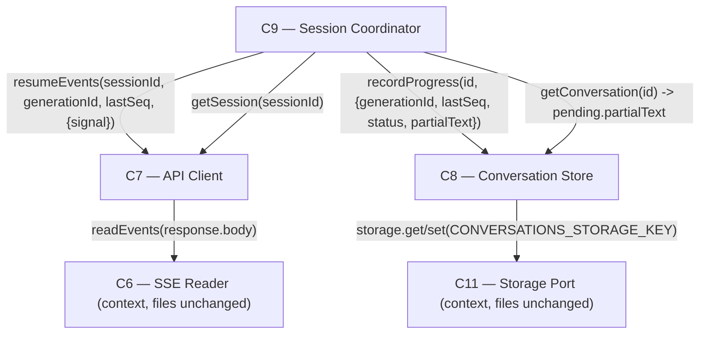

# As Built — M5

Baseline: `052db73fb28be6aff2699a57b5bdf2678d286fe9`
Change source: working tree (uncommitted) — `git diff 052db73..HEAD --name-status` is empty
because `src/`, `test/` and `web/` are untracked at this baseline; `git status --porcelain`
is the only place the change set is visible.

## Diagram

## Components Observed

| Id | Name | Files | Claimed? |
| --- | --- | --- | --- |
| C7 | API Client | `web/src/api-client.ts` (modified: `resumeEvents`, `AbortSignal` on `generate`/`resumeEvents`), `test/web/api-client.test.ts` | Yes |
| C8 | Conversation Store | `web/src/conversation-store.ts` (modified: `PendingGeneration.partialText`, `normalizePending` backward-compat), `test/web/conversation-store.test.ts` | Yes |
| C9 | Session Coordinator | `web/src/session-coordinator.ts` (modified: `resumeIfInterrupted`, `ResumeResult`, `resumeFromSessionSnapshot`, pending no longer cleared on transport failure), `test/web/session-coordinator.test.ts` | Yes |
| C6 | SSE Reader | no file in this milestone's change set — appears only as the target of a call inside modified `C7` code | Yes (claimed as "exercised unchanged") |
| C11 | Storage Port | no file in this milestone's change set — appears only as the target of a call inside modified `C8` code | Yes (claimed as "what the fresh-coordinator resume reads from") |

## Edges Observed

| From | To | What crosses | Evidence |
| --- | --- | --- | --- |
| C9 | C7 | `resumeEvents(sessionId, generationId, lastSeq)` | `web/src/session-coordinator.ts:422-426` — `apiClient.resumeEvents(sessionId, generationId, pending.lastSeq)` inside `resumeIfInterrupted` |
| C9 | C7 | `getSession(sessionId)` | `web/src/session-coordinator.ts:357` (`resumeFromSessionSnapshot`) and `:472` (`resumeIfInterrupted`'s post-resume reconcile) |
| C9 | C8 | `recordProgress(conversationId, {generationId, lastSeq, status, partialText})` | `web/src/session-coordinator.ts:148-153` (`consumeEventStream`, now carries `partialText: text`) and `:247-252`, `:379`, `:555-560` |
| C9 | C8 | `getConversation(id)` read of `conversation.pending.partialText` | `web/src/session-coordinator.ts:411-418, 451` — `pending.partialText` passed as `consumeEventStream`'s `startText` |
| C7 | C6 | `readEvents(response.body)` | `web/src/api-client.ts:284` — inside the new `resumeEvents` method |
| C8 | C11 | `storage.set(CONVERSATIONS_STORAGE_KEY, JSON.stringify(conversations))` / `storage.get(...)` | `web/src/conversation-store.ts:54, 80` — unchanged call sites, now carrying the widened `PendingGeneration` shape via `normalizePending` (`:108-115`) |

## Unmapped Files

| File | Why it could not be attributed |
| --- | --- |
| `src/host/m5-proof.ts` | A host-side live-proof driver (imports C1's `config.ts`, C11's `createMemoryStorage`, C5's `createCredentialStore`, C7's `createApiClient`, C8's `createConversationStore`, C9's `createSessionCoordinator`, and C6's `HarnessEvent` type) that exercises all of them together to prove AC7 and the resume acceptance criteria against the live harness. It is not itself a shipped component — it constructs its own throwaway coordinators/stores and calls `process.exit`. Treated the same way M4's `src/host/m4-proof.ts` was treated in `.harness/as-built/M4.md`. |
| `package.json` | Untracked at this baseline (whole file, not a diff); the milestone attributes only one added line to M5, `"proof:m5": "bun run src/host/m5-proof.ts"`. Build/script config, not a component. |

## Claim vs Observation

No mismatch on the component list: C6, C7, C8, C9, C11 as claimed. C7, C8, C9 have modified
files in the change set; C6 and C11 have none, consistent with the claim's own wording that
C6 is "exercised unchanged" and C11 is only "what the fresh-coordinator resume reads from" —
both are confirmed as edges from modified C7/C8 code rather than as changed files themselves.

`src/host/m5-proof.ts`'s role is as claimed: it imports C7, C8, C9, C5, C6, C11, C1 and drives
them together; the claim's characterization of it as "a host-side driver standing in for
C10's caller role... proof scaffolding, not a component of the shipped app" matches what the
file's contents show (throwaway objects, `console.log`/`process.exit` control flow, no
export consumed elsewhere). No `web/src/ui/` file (C10 itself) appears in the change set.

One mismatch: the milestone's Architecture field states "No deviation from the agreed
architecture was required, so nothing is recorded under `## Deviations` in
`.harness/architecture.md`." `.harness/architecture.md`'s `## Deviations` section, as it
exists at HEAD, contains an entry titled "M5 — `PendingGeneration` gained a `partialText`
field, and C9 gained `ResumeResult`" (lines 328-338), describing exactly the two changes this
record also observed in `web/src/conversation-store.ts` and `web/src/session-coordinator.ts`.
The claim that nothing is recorded there does not match the file's actual content.
