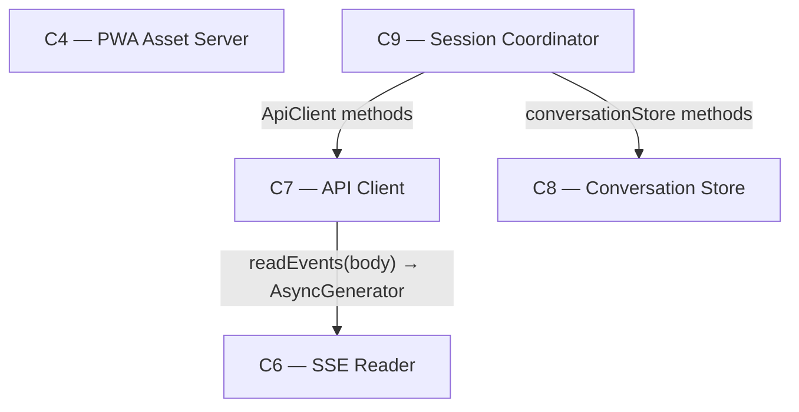

# As Built — M5a

Baseline: `052db73fb28be6aff2699a57b5bdf2678d286fe9` on `main`
Change source: working tree (untracked and uncommitted files)

## Diagram

## Components Observed

| Id | Name | Files | Claimed? |
| --- | --- | --- | --- |
| C4 | PWA Asset Server | src/host/pwa-server.ts | Yes |
| C6 | SSE Reader | web/src/sse-reader.ts, test/web/sse-reader.test.ts | Yes |
| C7 | API Client | test/web/api-client.test.ts | Yes |
| C8 | Conversation Store | test/web/conversation-store.test.ts | Yes |
| C9 | Session Coordinator | web/src/session-coordinator.ts, test/web/session-coordinator.test.ts | Yes |

## Edges Observed

| From | To | What crosses | Evidence |
| --- | --- | --- | --- |
| C7 | C6 | `readEvents(body: ReadableStream) → AsyncGenerator<HarnessEvent>` | web/src/api-client.ts line 1: `import { readEvents, type HarnessEvent } from "./sse-reader"` |
| C9 | C7 | ApiClient methods (listProfiles, createSession, appendTurn, generate, cancel, resumeEvents, getSession) | web/src/session-coordinator.ts lines 1–2: `import type { ApiClient, SessionSnapshot } from "./api-client"` |
| C9 | C8 | ConversationStore methods (loadConversations, saveConversation, recordProgress, getConversation, setSessionId, setProfileId, createConversation, appendTurn) | web/src/session-coordinator.ts line 7: imports from "./conversation-store" |

## Unmapped Files

| File | Why it could not be attributed |
| --- | --- |
| bun.lock | Dependency lock file, not a component |
| package.json | Project configuration file, not a component |
| tsconfig.json | TypeScript configuration file; architecture.md explicitly states "Repository-wide type-checking is build tooling, not a component" |

## Changes by Component

### C4 — PWA Asset Server
**File: src/host/pwa-server.ts**
- Type annotation change: return type of `createPwaServer` changed from `Bun.Server` to `Bun.Server<never>` to satisfy stricter TypeScript type checking.

### C6 — SSE Reader
**Files: web/src/sse-reader.ts, test/web/sse-reader.test.ts**
- **Interface change**: Return type of `readEvents(body: ReadableStream<Uint8Array>)` changed from `AsyncIterable<HarnessEvent>` to `AsyncGenerator<HarnessEvent>` (line 40).
- Type exports changed: `HarnessEvent` and `Telemetry` now exported as types for import into tests.
- Test fix: Line 392 in test, `await iterator.return?.()` changed to `await iterator.return?.(undefined)` to satisfy type checking.

### C7 — API Client
**File: test/web/api-client.test.ts**
- Type fixes: Multiple `mockFetch.fetch` casts to `typeof fetch` (lines 58, 700, 1337, 1370, 1402) to satisfy type checking.
- Type guards: `init?.signal` narrowed to `init?.signal ?? undefined` (lines 1327, 1360) for type safety.
- **New test at line 1178**: `sends Last-Event-ID header as -1 when lastSeq is -1` verifies `resumeEvents` correctly sends `Last-Event-ID: -1` when resuming from `lastSeq === -1` (no events received before drop).

### C8 — Conversation Store
**File: test/web/conversation-store.test.ts**
- Type guards: Added `@ts-expect-error` comments and optional chaining (`?.`) to accommodate `noUncheckedIndexedAccess` TypeScript strictness.
- Examples: lines 120, 123, 126, 337, 592, 594, 654, 657 add null-safety guards.

### C9 — Session Coordinator
**Files: web/src/session-coordinator.ts, test/web/session-coordinator.test.ts**
- **Behavior change (source)**: Lines 382–396 in `web/src/session-coordinator.ts` implement a reconciliation fix: when falling back to `seq_not_available` (snapshot reconciliation), `ResumeResult.text` now returns the reconciled assistant text from the last assistant turn in the conversation, not the partial text pre-drop. Fallback to `partialText` if no assistant turn exists.
- Type guards: Test file adds `@ts-expect-error` comments and null-safety checks (lines 480–493, 644, 950).
- **New test at line 1248**: `returns the reconciled assistant text from the snapshot when falling back to seq_not_available, not the partial text` verifies the behavior change. Sets `partialText: "The ans"` (incomplete), calls `resumeEvents`, triggers `seq_not_available`, and verifies result.text returns `"The answer is 42."` (the reconciled assistant turn, not the partial).
- **New test at line 1316**: `resumes with lastSeq === -1 (no events received before drop), sends it to resumeEvents, and replays from seq 0 with no gaps` verifies that a pending record with `lastSeq: -1` is correctly passed to `resumeEvents` and that sequence numbers are contiguous from 0. Adds helper `generateResumeFromSeqZeroEvents()` at line 1520 to yield a [0, 1, 2] sequence.

## Claim vs Observation

**Claim:** "No component is added, removed or re-scoped. C9 (Session Coordinator) changes behaviour on one branch only. Repository-wide type-checking is build tooling, not a component, and does not appear in `.harness/architecture.md`. No deviation is expected; record one if the type check forces an interface change."

**Observation:**

1. **No component added, removed, or re-scoped:** ✓ Confirmed. All observed components (C4, C6, C7, C8, C9) are in the agreed architecture.

2. **C9 changes behaviour on one branch only:** ✓ Confirmed. C9's `resumeIfInterrupted` method's fallback path (seq_not_available) now reads reconciled text from the conversation instead of returning partial text. This is the only behavior change observed.

3. **Repository-wide type-checking is build tooling:** ✓ Confirmed. `tsconfig.json` changes and `bun.lock`/`package.json` dependency addition are tooling, not components. All three files go unmapped correctly.

4. **Interface change observed:** ✓ **Deviation recorded.** The claim says "No deviation is expected; record one if the type check forces an interface change." This condition has occurred: C6's `readEvents` return type changed from `AsyncIterable<HarnessEvent>` to `AsyncGenerator<HarnessEvent>` (line 40 of web/src/sse-reader.ts). This matches the architecture's `C7 → C6` interface, but the written interface specifies `AsyncIterable`, not `AsyncGenerator`. The change was forced by TypeScript's stricter type checking (`tsc --noEmit` went from exit 1 (130 errors) to exit 0).

**Summary:** No mismatch between claim and observation regarding components or behavior. The interface change to C6's return type is an observed deviation per the claim's own condition.
