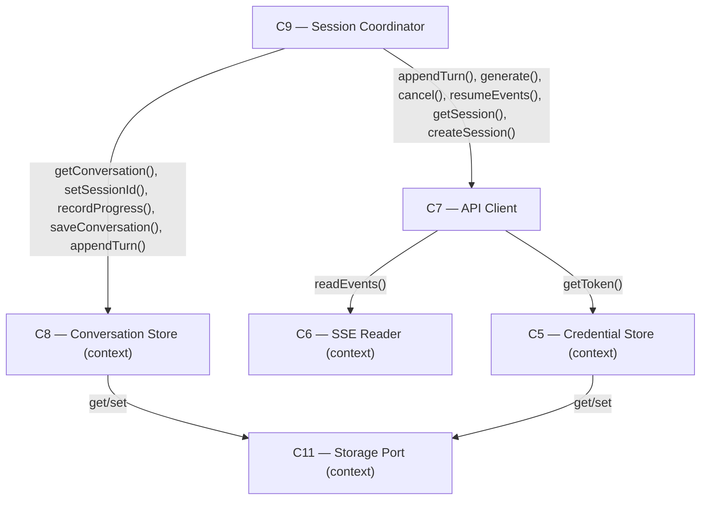

# As Built — M6

Baseline: `052db73fb28be6aff2699a57b5bdf2678d286fe9`
Change source: working tree

## Diagram

## Components Observed

| Id | Name | Files | Claimed? |
| --- | --- | --- | --- |
| C5 | Credential Store | web/src/credential-store.ts | No (context, used in proof) |
| C6 | SSE Reader | web/src/sse-reader.ts | No (context, dependency of C7) |
| C7 | API Client | web/src/api-client.ts | Yes |
| C8 | Conversation Store | web/src/conversation-store.ts | Yes |
| C9 | Session Coordinator | web/src/session-coordinator.ts | Yes |
| C11 | Storage Port | web/src/storage-port.ts | Yes |

## Edges Observed

| From | To | What crosses | Evidence |
| --- | --- | --- | --- |
| C7 | C5 | `getToken()` called | api-client.ts:108 `const token = getToken()` in makeRequest |
| C7 | C6 | `readEvents(body)` called | api-client.ts:253, 288 in generate() and resumeEvents() |
| C9 | C7 | `appendTurn()` called in session recovery | session-coordinator.ts:277 `await apiClient.appendTurn(newSessionId, {...})` |
| C9 | C7 | `generate()`, `createSession()`, `cancel()`, `resumeEvents()`, `getSession()` | session-coordinator.ts:251, 266, 286, 296, 396, 407, 488, 538 |
| C9 | C8 | `getConversation()`, `setSessionId()`, `recordProgress()`, `appendTurn()`, `saveConversation()` | session-coordinator.ts:200, 229, 239, 267, 295, 319, 338, 343, 359, 365, 383, 429, 436, 477, 524, 536, 539 |
| C8 | C11 | `storage.get()`, `storage.set()` | conversation-store.ts:54, 80 |
| C5 | C11 | `storage.get()`, `storage.set()` | credential-store.ts via getCredential/setCredential |

## Files in M6 Change Set

| File | Component | Purpose |
| --- | --- | --- |
| web/src/api-client.ts | C7 | Added appendTurn(sessionId, turn) method (lines 317-345) to POST /v1/sessions/{id}/turns |
| web/src/session-coordinator.ts | C9 | Modified send() method to handle unknown_session 404: rebuild session, replay turns, retry once (lines 242-292) |
| web/src/conversation-store.ts | C8 | No changes in M6 (component already existed from prior milestones) |
| web/src/storage-port.ts | C11 | No changes in M6 (component already existed from prior milestones) |
| test/web/api-client.test.ts | — | 8 new tests for appendTurn: success, method/URL/headers/body, 404, 401, 400, malformed response, request log |
| test/web/session-coordinator.test.ts | — | 6 new tests for session-loss recovery path in send() |
| src/host/m6-proof.ts | — | New proof script: 4 phases demonstrating M6 acceptance criteria live (A: establish conversation, B: verify 404 and rebuild, C: verify transcript matches after replay, D: verify 401 does not trigger rebuild) |
| package.json | — | Added `"proof:m6": "bun run src/host/m6-proof.ts"` script entry |

## Unmapped Files

| File | Why it could not be attributed |
| --- | --- |

(No unmapped files. All changes are attributed to components or tests/proofs.)

## Claim vs Observation

**Claimed: C7, C8, C9, C11**

**Mismatch: Claimed but not modified in M6's diff**

- **C8 — Conversation Store:** Claimed, but no code changes visible in M6's diff. The component's existing methods are *called* by C9's new recovery logic (setSessionId, recordProgress, appendTurn, saveConversation), but the component itself was not modified. This is consistent with M6's scope: the component's interface was already sufficient; M6 only changed C9 to use it for session recovery.

- **C11 — Storage Port:** Claimed, but no code changes visible in M6's diff. The component continues to be used through C8's persistence calls, but the component itself was not modified. This is consistent with M6's scope: M6 needed the existing persistence layer, not changes to it.

**No other mismatches.** All other claimed components (C7, C9) show observable modifications in the diff.

**Additional observation: Components used but not claimed**

- **C5 — Credential Store:** Used in `src/host/m6-proof.ts` (line 36-37) but not listed as claimed. This is correct: C5 was built in earlier milestones; M6 does not modify it, only the proof uses it as part of exercising the full stack.

- **C6 — SSE Reader:** Used by C7 (api-client.ts:253, 288) but not listed as claimed. This is correct: C6 was built in earlier milestones; M6 does not modify it, only C7 already depends on it for streaming.

**Conclusion:** Claim vs observation is consistent. C8 and C11 were claimed because M6's recovery logic depends on them; C5 and C6 are not claimed because M6 does not touch them (they were integrated in prior milestones).
