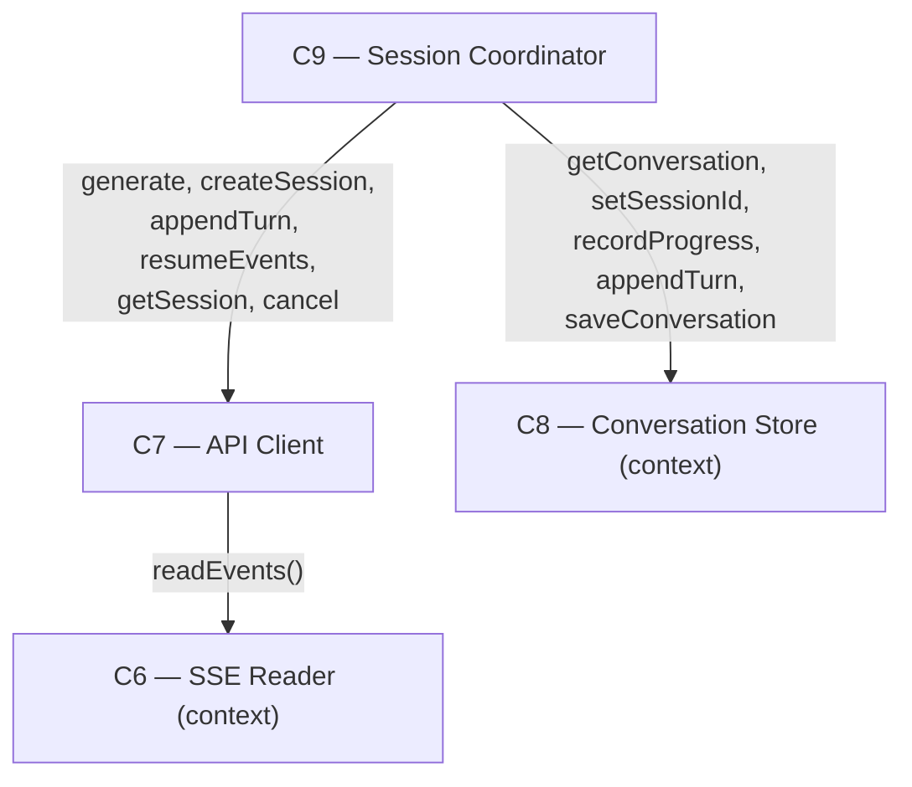

# As Built — M7

Baseline: 052db73fb28be6aff2699a57b5bdf2678d286fe9
Change source: working tree (all M1-M7 source untracked; no git diff applied)

## Diagram

## Components Observed

| Id | Name | Files | Claimed? |
| --- | --- | --- | --- |
| C6 | SSE Reader | (pre-existing, unchanged) | No — context |
| C7 | API Client | web/src/api-client.ts | Yes |
| C8 | Conversation Store | (pre-existing, unchanged) | No — context |
| C9 | Session Coordinator | web/src/session-coordinator.ts | Yes |

## Edges Observed

| From | To | What crosses | Evidence |
| --- | --- | --- | --- |
| C7 | C6 | `readEvents(response.body)` call | api-client.ts line 572 (generate), line 607 (resumeEvents) |
| C9 | C7 | `ApiClient` interface calls | session-coordinator.ts: generate (line 262), createSession (line 249), appendTurn (line 288), resumeEvents (line 509), getSession (line 425), cancel (line 414) |
| C9 | C8 | `ConversationStore` interface calls | session-coordinator.ts: getConversation, setSessionId, recordProgress, appendTurn, saveConversation throughout send() and resumeIfInterrupted() |

## Unmapped Files

| File | Why it could not be attributed |
| --- | --- |
| src/host/m7-proof.ts | Proof/test harness (exercises C5, C7, C8, C9, C11 but realizes no component itself) |
| package.json | System artifact (added `"proof:m7"` script line) |
| test/web/api-client.test.ts | Test code for C7 (not a component implementation) |
| test/web/session-coordinator.test.ts | Test code for C9 (not a component implementation) |

## Claim vs Observation

**C5 claimed, not observed in component code:** The milestone's `### Architecture` field claims `C5, C7, C9`. The Outcome states "C5 (Credential Store) was exercised unchanged by the proof (`credentialStore.getToken()`)". C5 is instantiated and called in the proof file (src/host/m7-proof.ts, line 34), but neither changed component (C7 nor C9) imports or calls C5. C7 receives `getToken()` as a function parameter in `createApiClient()` options, maintaining the abstraction. **Mismatch: C5 is claimed but does not appear in the component code changes; it is exercised only in the proof.**

**C6 observed, not claimed:** C7 imports `readEvents` from `web/src/sse-reader.ts` and calls it at line 572 in `generate()` and line 607 in `resumeEvents()`. C6 is pre-existing (agreed in architecture, built in earlier milestones) and remains unchanged; M7's code simply crosses into it. **Not a mismatch; context component.**

**C7 claimed, observed:** File `web/src/api-client.ts` changed. C7 now exports error type unions (`HttpErrorCode`, `StreamErrorCode`), error classes (`HarnessApiError`, `HarnessStreamError`, `HarnessOfflineError`, `EmptyPromptError`), guidance tables (`HTTP_ERROR_GUIDANCE`, `STREAM_ERROR_GUIDANCE`), guidance lookup functions, and modified `makeRequest()` to catch network errors and wrap them as `HarnessOfflineError`. Also added empty-prompt validation in `generate()` that throws `EmptyPromptError` before any request. **Match.**

**C8 observed, not claimed:** C9 imports and calls `ConversationStore` methods (`getConversation`, `setSessionId`, `recordProgress`, `appendTurn`, `saveConversation`). C8 is pre-existing and remains unchanged. **Not a mismatch; context component.**

**C9 claimed, observed:** File `web/src/session-coordinator.ts` changed. C9 now passes typed `HarnessStreamError` instances to a widened `onError` handler callback (signature changed from `(code: string)` to `(code: string, error: HarnessStreamError)`). `SendResult` and `ResumeResult` now carry `streamError` field. On `HarnessOfflineError`, `send()` preserves the prompt in `draftPrompt` before re-throwing (lines 390-393). Also validates empty prompts at C9 level (line 234). **Match.**

**Summary:** Three entries in `Claimed Components`; two match (C7, C9), one does not (C5 not observed in component code). Two additional components observed as context (C6, C8) that are neither claimed nor new.
