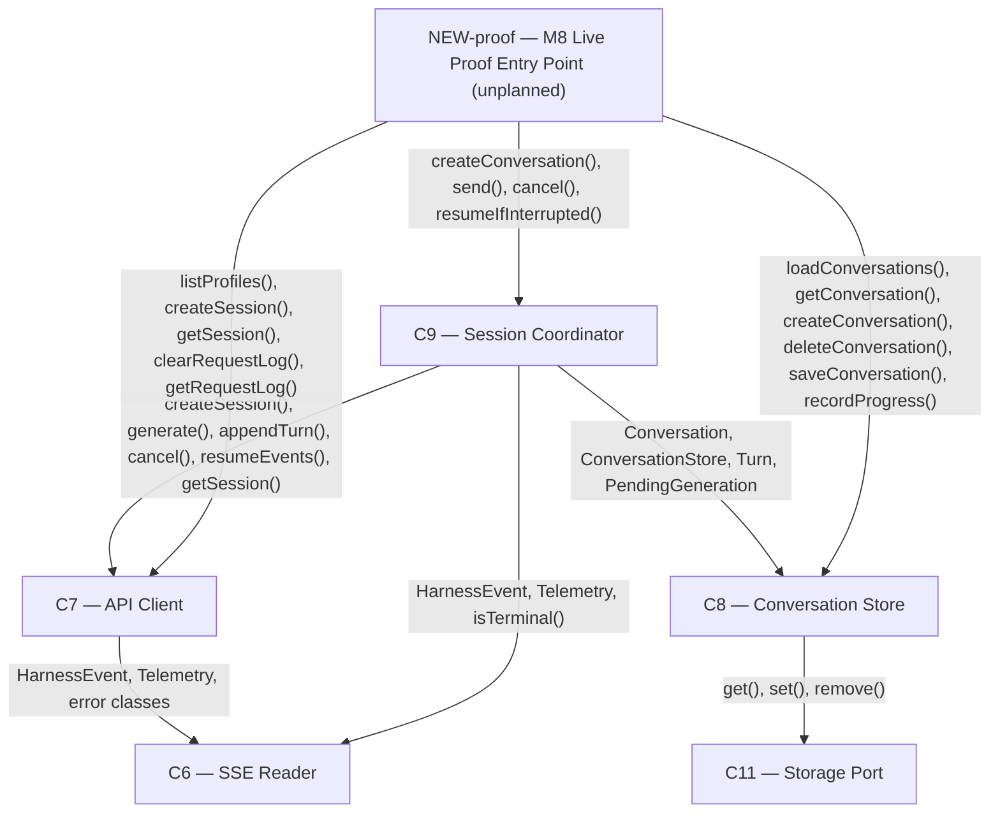

# As Built — M8

Baseline: `052db73fb28be6aff2699a57b5bdf2678d286fe9`
Change source: working tree (untracked files)

## Diagram

## Components Observed

| Id | Name | Files | Claimed? |
| --- | --- | --- | --- |
| C6 | SSE Reader | `web/src/sse-reader.ts` | No — context only |
| C7 | API Client | `web/src/api-client.ts` | No — context only |
| C8 | Conversation Store | `web/src/conversation-store.ts` | Yes |
| C9 | Session Coordinator | `web/src/session-coordinator.ts` | Yes |
| C11 | Storage Port | `web/src/storage-port.ts` | Yes |
| NEW-proof | M8 Live Proof Entry Point | `src/host/m8-proof.ts` | No |

## Edges Observed

| From | To | What crosses | Evidence |
| --- | --- | --- | --- |
| C7 | C6 | `readEvents()` call, HarnessEvent type, Telemetry type | `web/src/api-client.ts:1` imports `readEvents` and `HarnessEvent` |
| C9 | C7 | Session and generation management API calls | `web/src/session-coordinator.ts:1-6` imports ApiClient, error types; line 245 calls `apiClient.createSession()`, lines 283-324 call `apiClient.generate()`, etc. |
| C9 | C8 | Conversation persistence and state management | `web/src/session-coordinator.ts:8-13` imports Conversation, ConversationStore, etc.; line 244 calls `conversationStore.createConversation()`, line 246 calls `conversationStore.setSessionId()`, etc. |
| C9 | C6 | Event type definitions and stream processing | `web/src/session-coordinator.ts:14-15` imports HarnessEvent, Telemetry, isTerminal; used throughout `consumeEventStream()` |
| C8 | C11 | Versioned persistence operations | `web/src/conversation-store.ts:1` imports StoragePort; line 114 calls `storage.get()`, line 148 calls `storage.set()` |
| NEW-proof | C9 | Test scenario entry points | `src/host/m8-proof.ts:37-40` calls `sessionCoordinator.createConversation()`, line 119 calls `send()`, line 203 calls `deleteConversation()` |
| NEW-proof | C8 | Direct store access for verification | `src/host/m8-proof.ts:36` instantiates `conversationStore`; line 140 calls `conversationStore.getConversation()`, line 180 calls `loadConversations()`, line 203 calls `deleteConversation()` |
| NEW-proof | C7 | API profiling and validation | `src/host/m8-proof.ts:31-34` instantiates `apiClient`; lines 87, 124 call `apiClient.getRequestLog()`, line 104 calls `getSession()`, line 48 calls `listProfiles()` |

## Unmapped Files

| File | Why it could not be attributed |
| --- | --- |
| `package.json` | Build script metadata only (added `proof:m8` script); does not implement a component boundary |
| `.harness/architecture.md` | Harness metadata and deviation record; not part of the system being built |
| `test/web/conversation-store.test.ts` | Test file, not system code (C8 component) |
| `test/web/session-coordinator.test.ts` | Test file, not system code (C9 component) |

## Claim vs Observation

**M8 claims to realise C8, C9, and C11.**

- **C8 (Conversation Store):** Claimed realisation verified. The file `web/src/conversation-store.ts` shows:
  - Export of `CONVERSATIONS_SCHEMA_VERSION` constant (value 1) at line 36
  - Export of `UnknownStorageVersionError` class at lines 50-64, throwing on mismatched versions
  - Versioned envelope structure (lines 38-41, 143-148) wrapping conversations in `{ version, conversations }`
  - `deleteConversation(id: string): void` method at lines 288-295
  - Dependency on C11 alone (line 1 imports only `StoragePort`)
  - `ConversationStore` interface exposure at line 89 with all claimed methods

- **C9 (Session Coordinator):** Claimed realisation verified. The file `web/src/session-coordinator.ts` shows:
  - `SessionCoordinator` interface export at lines 49-64 includes `createConversation()` entry point at lines 50-53
  - Implementation of `createConversation()` at lines 240-247 calling `apiClient.createSession()` exactly once (line 245)
  - `send()`, `cancel()`, `resumeIfInterrupted()` methods all present with their previously claimed signatures
  - Dependencies on C7 (api-client) and C8 (conversation-store) only
  - No direct dependency on C11; access to storage goes through C8

- **C11 (Storage Port):** Claimed unchanged. The file `web/src/storage-port.ts` shows:
  - `StoragePort` interface with `get()`, `set()`, `remove()` methods unchanged from agreed definition
  - `createMemoryStorage()` and `createLocalStorageStorage()` implementations present
  - No changes from the claimed state

**Deviations:** The milestone itself (section "### Architecture") acknowledges one deviation: `createConversation` was added to C9's public surface, widening the `C10 → C9` interface beyond what was written. This is recorded in `.harness/architecture.md` under `## Deviations` as `**M8 — ...**` (marked `Material: no`).

**Components observed but not claimed:** C6 and C7 are pre-existing components that appear here only as context, because C9's already-claimed dependency on them is exercised during M8 testing. NEW-proof is unplanned — it is the live-harness proof entry point mandatory for this milestone, sitting outside the component model's scope.

No mismatch.
