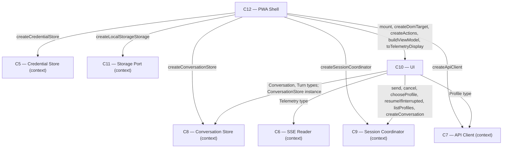

# As Built — M9

Baseline: 052db73fb28be6aff2699a57b5bdf2678d286fe9
Change source: working tree

## Diagram

## Components Observed

| Id | Name | Files | Claimed? |
| --- | --- | --- | --- |
| C10 | UI | web/src/ui/view-model.ts, web/src/ui/actions.ts, web/src/ui/mount.ts, web/src/ui/render-target.ts, web/src/ui/dom-target.ts | Yes |
| C12 | PWA Shell | web/src/main.ts, web/public/index.html | Yes |
| C9 | Session Coordinator | web/src/session-coordinator.ts (modified: +listProfiles, +setProfile) | Pre-existing |

## Edges Observed

| From | To | What crosses | Evidence |
| --- | --- | --- | --- |
| C10 | C9 | send, cancel, chooseProfile, resumeIfInterrupted, listProfiles, createConversation | actions.ts calls coordinator.send/cancel/setProfile/resumeIfInterrupted/listProfiles/createConversation; mount.ts injects coordinator and calls createActions(coordinator) |
| C10 | C8 | Conversation, Turn types; ConversationStore instance | view-model.ts imports Conversation, Turn from conversation-store; mount.ts imports ConversationStore type and takes store: ConversationStore in MountDeps |
| C10 | C7 | Profile type | actions.ts, mount.ts, view-model.ts import Profile from api-client |
| C10 | C6 | Telemetry type | view-model.ts imports Telemetry from sse-reader and maps to TelemetryDisplay via toTelemetryDisplay |
| C12 | C10 | mount, createDomTarget, createActions, buildViewModel, toTelemetryDisplay | main.ts imports all five from ui/ and re-exports them; bootstrap() calls mount with injected target from createDomTarget |
| C12 | C11 | createLocalStorageStorage | main.ts imports and calls createLocalStorageStorage(window.localStorage) in bootstrap |
| C12 | C8 | createConversationStore | main.ts imports and calls createConversationStore(storage) in bootstrap |
| C12 | C5 | createCredentialStore | main.ts imports and calls createCredentialStore(storage) in bootstrap |
| C12 | C7 | createApiClient | main.ts imports and calls createApiClient with credential in bootstrap |
| C12 | C9 | createSessionCoordinator | main.ts imports and calls createSessionCoordinator with apiClient and conversationStore in bootstrap |

## Unmapped Files

| File | Why it could not be attributed |
| --- | --- |
| test/web/ui/view-model.test.ts | Test file for C10; maps to C10 |
| test/web/ui/actions.test.ts | Test file for C10; maps to C10 |
| test/web/ui/mount.test.ts | Test file for C10; maps to C10 |
| test/web/ui/bundle-mount.test.ts | Test file for C10; maps to C10 |
| test/web/session-coordinator.test.ts | Modified test file for C9; maps to C9 |

(All test files are unambiguously attributed to the components they test.)

## Claim vs Observation

No mismatch.

Both components claimed (C10, C12) were observed:
- **C10 (UI)** claimed and observed: five new modules in web/src/ui/ (view-model.ts, actions.ts, mount.ts, render-target.ts, dom-target.ts) with deliberate seam through render-target.ts separating DOM-free and DOM-touching halves.
- **C12 (PWA Shell)** claimed and observed: web/src/main.ts rewritten as bundle entry point with composition-root bootstrap() and re-exports of C10 surface; web/public/index.html remains unchanged.

Deviations recorded in architecture.md under M9 entry confirmed accurate and observed in code:
- C9 gained `listProfiles()` and `setProfile()` methods (one-to-one pass-throughs onto C7 and C8 respectively).
- C10 internally structured as four DOM-free modules plus one DOM-touching module, with render-target.ts as deliberate seam.
