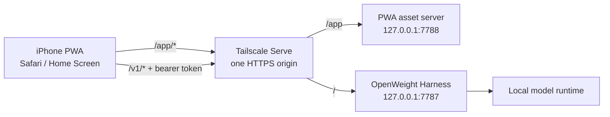
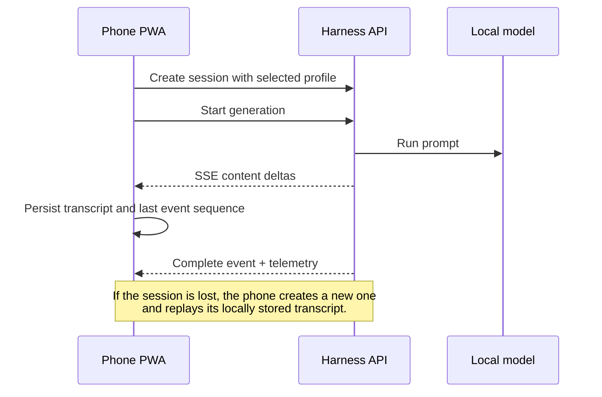

# Phone Reasoning Surface

A small, installable web app for talking to an OpenWeight Harness running on a Mac from an iPhone. It keeps inference on the Mac, exposes the harness only to the owner's Tailscale network, and gives the phone a native-feeling chat surface with streaming responses, conversation history, profile selection, cancellation, and recovery from lost server sessions.

This repository is the phone-facing client and its Mac-side delivery tooling. It does **not** contain or manage the model runner itself; an existing OpenWeight Harness must already be running.

## How it fits together

The PWA and harness API are published on one HTTPS origin. This is important because the harness does not send CORS headers: `/app` is served by this repository, while `/v1` continues to reach the harness.



The browser stores credentials, conversations, transcripts, and stream resume points locally. Responses arrive as server-sent events (SSE), so text is rendered incrementally rather than waiting for a complete answer.



## What it supports

- Multiple locally persisted conversations, each backed by a harness session.
- Runtime discovery and selection of harness profiles—profile IDs are not compiled into the app.
- Incremental streamed replies, queue/loading state, completion telemetry, and cancellation.
- Resume metadata for interrupted streams and snapshot reconciliation when an event sequence is no longer available.
- Automatic session recreation and transcript replay after the harness loses a session.
- Typed, user-facing guidance for documented HTTP and stream errors.
- QR-code pairing without sending the token to either server: the secret is placed in the URL fragment, captured by the PWA, and immediately removed from the address bar.
- An in-app pairing screen for iOS home-screen installations, whose storage can be separate from Safari.
- A service worker, web manifest, and iOS icons for standalone installation.

Stream reconnection after an arbitrary live transport drop is currently active milestone work; see [`.harness/milestones.md`](.harness/milestones.md) for the exact status and evidence behind each capability.

## Prerequisites

- macOS with an OpenWeight Harness running on loopback (the established setup uses port `7787`).
- Tailscale installed on the Mac and iPhone, with both devices on the same tailnet.
- [Bun](https://bun.sh/) (this project was developed with Bun 1.4.0).
- A harness bearer token at `~/.openweight-harness/token`, readable only by its owner.

The checked-in default public origin is specific to the original machine. Other installations should set `OPENWEIGHT_HARNESS_BASE_URL` to their own Tailscale HTTPS origin.

## Set up the Mac

Install dependencies and build the static PWA:

```sh
bun install
bun run build
```

Start the asset server interactively while developing:

```sh
bun run serve
```

For normal use, install it as a per-user macOS LaunchAgent so it starts automatically and is restarted if it exits:

```sh
bun run install:launch-agent
```

Preserve the harness's existing `/` proxy and add `/app` as a second Tailscale Serve handler:

```sh
./deploy/install-serve.sh check
./deploy/install-serve.sh apply
```

The resulting mapping should be equivalent to:

```text
/      -> http://127.0.0.1:7787  (existing harness)
/app   -> http://127.0.0.1:7788  (this PWA)
```

The installer is deliberately narrow: it only changes the requested `/app` handler and verifies that the existing root handler was preserved.

## Pair the phone

Ensure the token file exists and has restrictive permissions:

```sh
chmod 600 ~/.openweight-harness/token
bun run pair
```

Scan the terminal QR code with the iPhone camera. To print the secret-bearing URL for pasting into an already-installed home-screen app, use:

```sh
bun run pair --show-url
```

Treat that URL like a password. Although its fragment is not transmitted in HTTP requests, anyone who obtains it obtains the harness token.

Once paired, open the app at `https://<your-tailscale-host>/app/`. In Safari, use **Share → Add to Home Screen** to install it as a standalone PWA.

## Configuration

| Environment variable | Default | Purpose |
| --- | --- | --- |
| `OPENWEIGHT_HARNESS_BASE_URL` | Original project's Tailscale HTTPS origin | Origin used in pairing URLs |
| `OPENWEIGHT_HARNESS_TOKEN_FILE` | `~/.openweight-harness/token` | Harness bearer-token file |
| `PHONE_PWA_PORT` | `7788` | Loopback port for the asset server |
| `PHONE_PWA_BUNDLE_ROOT` | `web/dist` | Built assets served by the Mac process |
| `BUN_BIN` | `~/.bun/bin/bun` in deploy wrappers | Bun executable used by shell installers |

If you change `PHONE_PWA_PORT`, use the same value when applying the Tailscale Serve mapping. Re-run the LaunchAgent installer after changing its environment or rebuilding from a relocated checkout.

## Development

```sh
bun test          # full test suite
bunx tsc --noEmit # whole-project type check
bun run build     # create web/dist
```

The `proof:m*` scripts in [`package.json`](package.json) are milestone-specific integration proofs. Several expect the live harness, its configured profiles, or a particular operator environment; they are not substitutes for the normal unit suite.

Key directories:

| Path | Responsibility |
| --- | --- |
| [`web/src`](web/src) | Browser app, UI, API client, SSE parsing, persistence, and session coordination |
| [`web/public`](web/public) | HTML shell, manifest, and app icons |
| [`src/host`](src/host) | Asset server, pairing CLI, macOS/Tailscale installers, and live proofs |
| [`src/qr`](src/qr) | Dependency-free QR encoding, Reed–Solomon error correction, and terminal/PNG rendering |
| [`scripts`](scripts) | Build and asset-generation scripts |
| [`test`](test) | Bun unit, integration, security, and bundle tests |
| [`.harness`](.harness) | Requirements, architecture records, milestone plans, reviews, and as-built evidence |

## Security model

- Network access is constrained by Tailscale; the loopback asset server is not exposed directly.
- API calls still require the harness bearer token.
- Pairing puts the token after `#`, which browsers do not include in HTTP requests.
- The pairing command refuses token files readable by group or other users.
- The asset server decodes and validates paths, enforces bundle-root containment, and rejects symlink escapes.
- Credentials and transcripts live in browser storage on the phone. Deleting browser/site data removes them; deleting a conversation removes its local transcript.

This is a purpose-built personal deployment, not a general multi-user authentication system. Keep the tailnet, Mac account, token file, and paired phone secured accordingly.

## Useful operations

```sh
# Inspect the Tailscale mapping without changing it
./deploy/install-serve.sh check

# Preview the exact mapping command
./deploy/install-serve.sh apply --dry-run

# Remove the PWA LaunchAgent
bun run install:launch-agent --uninstall
```

After changing browser code or public assets, run `bun run build`. The service worker uses a network-first shell strategy so a reachable Mac serves the current bundle while still allowing the installed shell to start when the asset server is temporarily unavailable.
